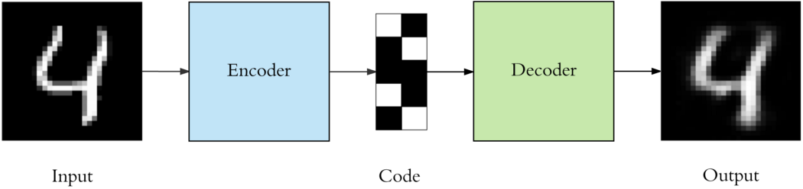

# Dimensionality reduction

Dimensionality reduction: projecting the data to a lower dimensional subspace which captures the “essence” of the data.

> One problem with mixture models is that they only use a single latent variable to generate the observations.

##  Principal Components Analysis (PCA)

通过调整坐标轴方向（[旋转变换](https://onedrive.live.com/view.aspx?resid=CC8075B9BE62A877%21462&id=documents&wd=target%28%E7%BA%BF%E6%80%A7%E4%BB%A3%E6%95%B0.one%7CD6D69CF6-DA58-4C27-B33D-21C4907CEFA2%2F%E7%BA%BF%E6%80%A7%E5%8F%98%E6%8D%A2%7CB8819F3F-0628-42EC-9650-F23141861898%2F%29
onenote:https://d.docs.live.net/cc8075b9be62a877/文档/数学/线性代数.one#线性变换&section-id={D6D69CF6-DA58-4C27-B33D-21C4907CEFA2}&page-id={B8819F3F-0628-42EC-9650-F23141861898}&object-id={8DA7629F-868C-0291-23C4-75124DDADE8A}&14)），建立一个新的坐标系构造新的特征空间，在新特征空间中，数据主要分布在主要特征（principle component）方向。

数据在各个特征方向（坐标轴）上的分布用投影长度来描述（反应数据在某个方向上的变化范围，因此需要对数据进行“中心化”处理）。

> 样本远离坐标原点时，旋转坐标系后在各坐标轴投影的相对变化范围减小，影响判定主成分的效果。

设数据样本为$\mathcal{S}=\{\bm{x}_1,\bm{x}_2,\cdots, \bm{x}_M\}$，其中$\bm{x}_i=(x_{1i},x_{2i},\cdots,x_{Ni})^{\top},i=1,\cdots,M$，为样本在标准坐标系中向量表示，新坐标系的==正交==基底为$(\bm{e}_1,\bm{e}_2,\cdots,\bm{e}_N)$，其中$\bm{e}_j=(e_{1j},e_{2j},\cdots,e_{Nj})^{\top}, j=1,\cdots,N$。$M$维样本数，$N$为特征数。

则$\bm{x}_i$在$\bm{e}_j$方向上的投影为：
$$
\newcommand{\bm}[1]{\boldsymbol{#1}} 
\newcommand{\b}[1]{\bold{#1}}
\newcommand{\t}[1]{{#1}^{\top}}
X_{ij}=\bm{x}_i^\top\cdot\bm{e}_j=\sum_{k=1}^N{x_{ki}e_{kj}}
$$
则所有样本在$\bm{e}_j$方向上的投影可表示为一个向量
$$
\begin{align*}
\bm{s}_j=\b{X}^T\bm{e}_j=\hat{\b{X}}\bm{e}_j,~~\b{X}&=(\bm{x}_i)_{i=1,\cdots,M},~~\hat{\b{X}}=\b{X}^\top=(\hat{\bm{x}}_j)_{j=1,\cdots,N}
\end{align*}
$$
由于投影可能为负值，因此使用二范数来代替，即
$$
\begin{align}
X_{ij}^2&=(\bm{x}_i^\top\cdot\bm{e}_j)^2=\left(\sum_{k=1}^N{e_{kj}x_{ki}}\right)^2\notag\\
&=\boldsymbol{e}_j^T\left[\begin{array}{cccc}
x_{1i}^2& x_{1i}x_{2i} & \cdots & x_{1i}x_{Ni}\\
x_{2i}x_{1i} & x_{2i}^2& \cdots & x_{2i}x_{Ni}\\
\vdots & \vdots & \ddots & \vdots \\
x_{Ni}x_{1i} & x_{Ni}x_{2i}& \cdots & x_{Ni}^2
\end{array}\right]\boldsymbol{e}_j
\end{align}
$$
因此所有样本在$\bm{e}_i$方向上的投影总和为：
$$
\begin{align*}
X_j^2&=\sum_{i=1}^M{(X_{ij})^2}\\
&=\bm{e}_j^T\left[\begin{array}{cccc}
\sum\limits_{i=1}^M{x_{1i}^2}& \sum\limits_{i=1}^M{x_{1i}x_{2i}} & \cdots & \sum\limits_{i=1}^M{x_{1i}x_{Ni}}\\
\sum\limits_{i=1}^M{x_{2i}x_{1i}} & \sum\limits_{i=1}^M{x_{2i}^2}& \cdots & \sum\limits_{i=1}^M{x_{2i}x_{Ni}}\\
\vdots & \vdots & \ddots & \vdots \\
\sum\limits_{i=1}^M{x_{Ni}x_{1i}} & \sum\limits_{i=1}^M{x_{Ni}x_{2i}}& \cdots & \sum\limits_{i=1}^M{x_{Ni}^2}
\end{array}\right]\boldsymbol{e}_j = \boldsymbol{e}^T_j\boldsymbol{P}\boldsymbol{e}_j \\
&=\boldsymbol{e}_j^T\left[\begin{array}{cccc}
\hat{\bm{x}}_1^\top\hat{\bm{x}}_1& \hat{\bm{x}}_1^\top\hat{\bm{x}}_2 & \cdots & \hat{\bm{x}}_1^\top\hat{\bm{x}}_N\\
\hat{\bm{x}}_2^\top\hat{\bm{x}}_1 & \hat{\bm{x}}_2^\top\hat{\bm{x}}_2& \cdots & \hat{\bm{x}}_2^\top\hat{\bm{x}}_N\\
\vdots & \vdots & \ddots & \vdots \\
\hat{\bm{x}}_N^\top\hat{\bm{x}}_1 & \hat{\bm{x}}_N^\top\hat{\bm{x}}_2& \cdots & \hat{\bm{x}}_N^\top\hat{\bm{x}}_N
\end{array}\right]\bm{e}_j
\end{align*}
$$

由此可达到$\bm{P}=\hat{\b{X}}^\top\hat{\b{X}}=\b{X}{\b{X}}^{\top}$。根据上述所有数据点投影的向量的表示形式，也可直接计算投影的总和为
$$
X_j^2=\bm{s}_j^\top\bm{s}_j=\bm{e}_j^\top\b{X}\b{X}^\top \bm{e}_j \notag
$$
可以看到矩阵$\b{X}{\b{X}}^{\top}$的元素是数据各特征维度的值之间的内积，反映了各维度本身的波动情况以及各维度之间的相关性。

> 当样本特征的均值为0时（可通过变换$X=X-\bar{X}$得到），上述矩阵$\bm{P}$中的项恰好为样本集合==各个特征维度==的（总体）方差和协方差的`M`倍，
> $$
> \begin{align*}
> \mathrm{Var}(\bm{f}_j)&=\frac{1}{M}\sum\limits_{i=1}^M{x_{ji}^2}\\
> \mathrm{Cov}(\bm{f}_j,\bm{f_k})&=\frac{1}{M}\sum\limits_{i=1}^M{x_{ji}x_{ki}}
> \end{align*}
> $$
>
>
> 即$\frac{1}{M}\bm{P}$是协方差矩阵。**方差与协方差正是反应了随机变量的变化程度。**

利用特征值分解可$\bm{P}$得：
$$
\bm{P}=\bm{U}\bm{\Sigma}\bm{U}^T=\b{X}\t{\b{X}}\notag
$$

$$
\begin{align}
\bm{e}^T_j\bm{P}\bm{e}_j&=(\bm{e}^T_j\bm{U})\bm{\Sigma}(\bm{U}^T\bm{e}_j)=(\bm{U}^T\bm{e}_j)^T\bm{\Sigma}(\bm{U}^T\bm{e}_j)\\
&=\bm{n}^T\bm{\Sigma}\bm{n}=\sum_{i=1}^n{\sigma_in_i^2}\notag\\
\bm{\Sigma}&=\left[\begin{array}{ccc}
\sigma_1 & &\\
& \sigma_2 & \\
&& \ddots
\end{array}\right] \notag,\\
\bm{n}&=\bm{U}^T\bm{e}_j~\longrightarrow~\bm{e}_j = \bm{U}\bm{n}, ~\|\bm{n}\|=1 \notag
\end{align}
$$
令特征值从大到小排列，为最大化投影，最大特征值$\sigma_1$对应$\bm{n}_1=(1,0,\cdots,0)$，由此可得新坐标系下对应的基向量（坐标轴）为$\bm{e}_1 = \bm{U}\bm{n}_1=\bm{U}_1$（$\bm{U}$的第一列向量）。其他特征方向的投影计算方式一样，但多了已知坐标轴的限制条件。以$\bm{e}_2$为例，==由于$\bm{e}_1\bot\bm{e}_2$==且$\bm{e}_1 = \bm{U}_1$，因此$\bm{U}_1^{\top}\bm{e}_2=0$，所以$\bm{n}_2=\bm{U}^T\bm{e}_2=(0,n_{22},\cdots,n_{N2})^T$。此时，投影求和为
$$
\boldsymbol{n}_2^T\boldsymbol{\Sigma}\boldsymbol{n}_2=\sum_{i=2}^n{\sigma_in_i^2}\notag
$$
为了最大化该投影，显然$n_{22}=1$，即$\bm{n}_2=(0,1,0,\cdots,0)$。因此$\bm{e}_2=\bm{U}_2$，依此类推，$\bm{e}_i=\bm{U}_i, \forall i=1,\cdots,N$，即第$i$个特征方向对应第$i$大特征值对应的特征向量。

> $\bm{n}$恰好是标准坐标系下的基底。

要计算点$\bm{x}$在新坐标系中的坐标，则分别计算其在新坐标系中各个维度上的投影长度，即：$\bm{y}=U^T\bm{x}$；若只选取前$k$个主要特征（主成分），则：$\bm{\hat{y}}={U_{(1,\cdots,k)}}^T\bm{x}$

### Kernel PCA

与PCA不同，当我们计算核矩阵（kernel matrix）$\bm{K}=\t{\b{X}}\b{X}$时，可通过矩阵特征值分解选取最大的$N$个特征值及其对应的特征向量，反向部分恢复$\b{X}$。
$$
\begin{align*}
\bm{K}&=\bm{U}\bm{\Lambda}\bm{U}^T=\t{\b{X}}\b{X}~\Longrightarrow~\\
\tilde{\b{X}}&=\tilde{\bm{\Lambda}}^{\frac{1}{2}}\t{\tilde{\bm{U}}},~~\tilde{\bm{\Lambda}}=\mathrm{diag}(\lambda_1,\cdots,\lambda_N),~~\tilde{\bm{U}}=(\bm{U}_i)_{i=1,\cdots,N}
\end{align*}
$$

> the covariance matrix is substituted by the Kernel matrix and the analysis is carried analogously in *feature space*. 
>
> 通常数据集合的样本点数远多于特征维数（$M\gg N$），选取值较大的特征可保留核矩阵的主要信息。在PCA中计算$\b{X}\t{\b{X}}$时，由于信息压缩（$N\times N$），无法恢复足够的原始点数（$N\times M$）。

### AutoEncoder

Autoencoder是一种特殊类型的前向神经网络（FNN），其输入和输出相同，将输入压缩为低维编码（latent space representation）并以此重建输出。

> Autoencoders are considered an *unsupervised* learning technique since they don’t need explicit labels to train on.

> Note that the decoder architecture is the mirror image of the encoder. This is not a requirement but it’s typically the case. 

参数：

- 码长（code size）；

- 层数（number of layers)；

  > The layers use the *relu* activation function, as it’s the standard with deep neural networks.
  >
  > The last layer uses the *sigmoid* activation because we need the outputs to be between [0, 1].

- 节点数（number of nodes per layer）；

- 损失函数：*mean squared error* (MSE) or *binary cross-entropy*.

  > If the input values are in the range [0, 1] then we typically use cross-entropy, otherwise we use the mean squared error. 

> **Note**: we should be careful to not make it too powerful. Otherwise the autoencoder will simply learn to copy its inputs to the output, without learning any meaningful representation.

#### Denoising Autoencoders

adding random noise to its inputs and making it recover the original noise-free data. the autoencoder can’t simply copy the input to its output because the input also contains random noise.

##### Convolutional Autoencoders

autoencoder stacked with convolution layers: replace fully connected layers by convolutional layers. 

#### Sparse Autoencoder

We can regularize the autoencoder by using a *sparsity constraint*  on **the code layer** such that only a fraction of the nodes would have nonzero values, called active nodes.

#### Applications

Though autoencoders are not widely used in real-world applications, they have 3 common use cases:

- Data denoising
- Dimensionality reduction
- Variational Autoencoders (VAE)

https://towardsdatascience.com/applied-deep-learning-part-3-autoencoders-1c083af4d798