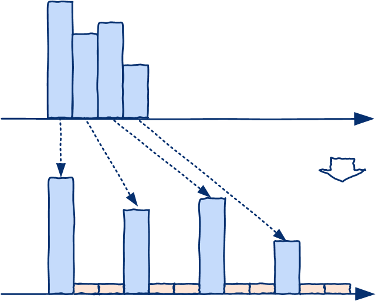

# 数学运算

## Python内置运算符和计算库

### 运算符

#### 算术运算符

`+`、`-`、`*`：

`/`：在python 2.x中对于整数除法，只返回整数部分；在python 3.x都返回浮点数；

`x**y` ：幂运算，返回$x^y$；

`//`：取整除 - 返回商的整数部分；`%` ：取模 - 返回除法的余数。

#### 比较运算符

| 运算符 | 描述                     | 运算符  | 描 述                |
| ------ | ------------------------ | ------- | -------------------- |
| `==`   | ==比较对象的值是否相等== | `!=` ： | 不等于，比较对象的值 |
| `>`    |                          | `<`     |                      |
| `>=`   |                          | `<=`    |                      |

> `<>`在Python3中不是合法的“不等于”运算符。

使用`is`运算符确定是否引用相同对象。`==`和`!=`运算符的默认行为与`is`一致，但多数==内置类型覆盖了默认行为，提供值比较功能==，包括：内置数值类型、字符串、序列类型（同类型）、字典、集合。

> 由同一字面值构造的字符串引用同一对象，某些字符串运算（如切片）得到的字串将产生新的对象（即使具有相同值）。因此比较字符串是否相等应该使用`==/!=`。
>
> `bool`值在系统中为常量，因此引用`True/False`的变量为相同对象（使用`is`和`==`等价）。较小的整数值（测试256以内）在系统也为常量，但大整数不是常量，因此应该同一使用`==`进行比较。
>
> `None`在程序中具有唯一引用，可使用`is`或`==`与之进行比较，但某些符合数据类型（如`pd.DataFrame`）重载了比较运算符用于比较元素而非对象，使用`==`时需要注意场景。

> "`x < y <= z`" is equivalent to "`x < y and y <= z`"

#### 赋值运算符

| 运算符 | 描述       | 运算符 | 描述     | 运算符 | 描述     |
| ------ | ---------- | ------ | -------- | ------ | -------- |
| `=`    |            | `+=`   |          | `-=`   |          |
| `*=`   |            | `/=`   |          | `%=`   | 取模赋值 |
| `**=`  | 幂运算赋值 | `//=`  | 整除赋值 |        |          |

#### 二进制数值运算符

整数位运算按`bit`进行，`bool`类型按逻辑关系运算。注意运算符优先级。
| 运算符 | 描述 | 运算符 | 描述   | 运算符 | 描述   |
| ------ | ---- | ------ | ------ | ------ | ------ |
| `&`    |      | <code>\|</code>  |        | `~`    | 非     |
| `^`    | 异或 | `<<`   | 左移位 | `>>`   | 右移位 |

> 整数的二进制表示（补码）有符号前缀位（0表示整数，1表示负数）。前缀也会参与执行位运算。
>
> `|`的优先级比`==`高，因此使用`|`连接两个比较表达式时应该使用`()`保证优先计算比较表达式。

### 数学函数

`math`包集成了常用的数学函数，包括三角函数、双曲函数、近似运算、指数、对数等。

`cmath`

### 时间日期

#### 时间差

`timedelta`：时间增量，可与`datetime`或`date`类型进行运算（与`date`类型运算时时，时间字段无效）；`timedelta`自身也可以与数值进行运算，内部存储转换为按天、秒和微妙计数。

> `date`对象仅与`timedelta`对象的日期部分运算。

```python
delta = dt.timedelta(days=1,hours=0,...)  # 构造时间差
delta = day2 - day1                       # 计算时间差
day = day + delta                         # 和时间对象运算
y = delta2/delta1                         # 时间差对象可进行除法，结果为实数
delta = delta2%delta1                     # 求余数运算，结果仍为时间差
```

> `pd.Timedelta`具有类似功能。

`Offset`：时间偏移量，具有固定单位；不同于`timedelta`，==支持年、月等非固定周期==。

```python
offset = pd.offsets.Day(5)  # offset.delta is <Timedelta>
offset.n                    # => number of unit e.g., 5
offset.name                 # => name of unit, e.g., 'D'
day = day + offset          # python时间对象也可以和pandas.Offset进行计算
```

> `MonthBegin/MonthEnd`偏移指定月份，并定位起始日期到月初/月末；`YearBegin/YearEnd`等同理。

#### 时间周期

`Period`可与数值、时间增量、时间偏移进行运算，实现周期平移。

```python
p = pd.Period(...)
p = p + 1                     # 起始时间增加一个周期
p = p + dt.timedelta(days=1)  # => pd.Timedelta
p = p + offset                # 起始时间增加一定偏移量
```

> 时间周期与时间偏移计算时，时间偏移的单位`offset.name`应该不小于时间周期的单位`p.freq.name`；类似地，`timedelta`的最小增量单位应该不小于时间周期的单位。

比较大小：

```python
tf = p2 > p1       # MUST have the same freq
```

计算偏移：

```python
offset = p2 - p1  # => pd.Offset
p1.freq           # => pd.Offset
```

**对齐时间周期**：调整其中一个时间周期对象，使两个时间周期相差整数倍的周期偏移：

```python
offset = p_align - p_base
n_offset = offset.n - offset.n % p_align.freq.n  
offset = pd.offsets.Day(n_offset)   # 假设周期单位为Day
p_align = p_base + p_align
```


## 矩阵

### 查找筛选

```python
indices = np.where(bool_expr[, x, y])
```

返回表达式`boo_expr`（例如`x==b`）的值为真的元素的下标，按行评估元素的值。返回类型为`tuple`，`indices[i]`为所有值为真的元素的第`i`维下标构成的`1D`向量。==当提供三个参数时，根据`bool_expr`的真值决定返回`x`或`y`的元素==（三个参数的维度需要兼容）。

> ```python
> # 将返回值转换为每个元素对应的坐标对
> idx_pair = np.array(indices).transpose() 
> ```

查找非零元素：

```python
idx_pair = np.argwhere(a)  # 即使a是一维向量，仍返回二维矩阵
```

返回一个二维矩阵，矩阵的每一行对应一个元素的坐标。

> ```python
> idx_pair = np.argmax()		# see argwhere()
> idx_pair = np.argmin()		# see argwhere()
> ```
>
> 返回元素的坐标分量单独保存：
>
> ```python
> indices = np.where(a!=0)   # 各维度坐标分别返回为一维向量
> indices = a.nonzero()	     # => np.where(a!=0) 
> ```

从矩阵中查找指定元素：

```python
indices = np.where(x==a0)
idx_pair = np.argwhere(x==a0)
```

> 对于一维向量，可以转换为Python序列（`list`），使用`index()`方法查找。

从矩阵中筛选满足条件的元素：

```python
a0 = np.extract(bool_expr,a)  # b = a[bool_expr]
```

### 计算

矩阵计算方法通常通过`np`模块访问，矩阵对象**主要**提供面向矩阵元素的数值计算方法。

#### 运算符

按元素计算：`+(add),-(substract),*(multiply),/(divide)`，`**(pow)`（幂），`%`（余数），`//`（向下取整整除），`+=,-=,...`（自运算符），`-(negative)`（一元取反运算符），`>,<,>=,<=,==,~=`；执行按元素计算时，如果运算数的维度不同，则会尝试自动扩展为维度相同的矩阵后进行计算（如行向量与列向量运算）。

```python
y=x**a  # => y=np.pow(x,a)
```

位运算符及其函数形式：`&(bitwise_and), |(bitwise_or), ^(bitwise_xor), ~(invert), >>(leftshift) <<(right_shift)`。

**广播机制**：矩阵/表格可以和维度兼容的序列类型进行运算（此时重载的是矩阵/表格的运算符而非序列类型运算符）。

矩阵运算规则（如矩阵乘法）计算。注意：`matrix`和稀疏矩阵的运算符`*`代表矩阵乘法，而非元素乘法。

```python
X=A@B		# 矩阵乘法 A.dot(B)
```


#### 计算函数

```python
np.absolute(a) # fabs(a)
np.divmod(a,b) # 返回商和余数
np.pow(a,x)    # exp(a), sqrt(a), square(a)
np.exp(x)      # e^x, exp2: 2^x, expm1: (e^x)-1
np.log(x)      # log2 log10
np.log1p(x)    # log(1+x)
np.logaddexp() # log(sum(exp()))
```

#### 复数运算

```python
np.angle(c)
np.real(c)
np.imag(c)
np.conj(c)   # conjugate(x), complex conjugate
```

#### 比较运算

`<`，`<=`，`>`，`>=`，`==`，`!=`

```python
np.maximum(a,b) # minimum(a,b), find max/min among a,b; preserve nan
np.fmax(a,b)    # fmin(a,b), drop nan
```

> 上述方法用于比较两个对象，返回两者之中较大（小）的元素组成的对象。

`NaN`（`float('nan')`和`np.nan`）与任何数值计算都返回`np.nan`；且`NaN!=NaN`，要比较两个`NaN`值，可以首先使用`np.isnan(x)`判断数值（矩阵）是否为`NaN`。

> `np.isnan()`不能用于非数值类型（如字符串）的矩阵。

#### 近似

```python
round(decimal)
floor
fix
ceil
trunc
```

#### 三角和双曲线函数

```python
np.sin(a)
```

#### 特征值

```python
e,v = np.linalg.eig(array) 
scipy.linalg.eig(array,...)
e,v = scipy.linalg.eigh(array, subset_by_index=[n-3,n-1])
```

返回特征值以升序排列。

#### 稀疏矩阵运算

为了防止运算破坏矩阵的稀疏性，稀疏矩阵运输算不支持：

- 广播机制，因此必须保证参与运算的矩阵维数相同（广播机制容易）。
- 与标量进行加/减运算。

稀疏矩阵与普通矩阵运算结果为普通矩阵（`matrix`）。

### 统计


```python
np.sum(a, axis, keepdims=None) 
np.cumsum(a)
np.max(a, axis)   # a.min(), find max/min in a
np.mean(a)
np.var(a)
np.std(a)
np.prod(a)
np.cumprod(a)
np.all(a, axis)	# return true if all is true
np.any(a, axis) # return true if any is true
np.count_nonzero(a, axis)
```

数值计算函数通常不仅能用于`ndarray`，也支持`list`等序列类型以及==表格类型==`pd.DataFrame`，因此使用`np.func(obj)`的调用方式比`array.func()`更加通用。

`axis=None`：默认对数组所有元素执行运算；如果设置为数值$i$，则对第$i$个维度方向的所有元素执行运算。对于矩阵，`0`代表行索引方向（即对一列数据进行运算），`1`代表列索引方向（对一行数据进行运算）。==`axis`对应数组的维度顺序（即`0`总是代表最前维度），与数组元素存储方式（`order='C'|'F'`）无关。==

`keepdims=True`：将保持计算结果维数不变（计算方向上长度为1）。

> Python自带`max`、`min`等函数是对序列类型元素或参数列表进行比较。

如果返回值为`True|False`，其类型为`numpy.bool_`而非Python内置`bool`类型，因此需要使用`==`而非`is`进行[比较](#比较运算符)。

##### 向量矩阵差分

```python
np.diff(a, n=1, axis=-1, prepend=None, append=None)
```

`n`：每`n`个点进行差分，如果`n=0`则返回原数据；
`axis`：默认沿最后一个坐标轴进行差分；
`prepend|append`：添加默认元素，以保证所有输入数据完成差分。如果未指定，==则输出结果将根据差分距离`n`减少==（默认不会包含`NaN`）；反之，指定值的维度需要与除差坐标轴外的其他维度一致，坐标轴方向长度至少为`n`；特别地，如果输入为向量，且`n=1`，则可以指定输入为标量。

#### 频数和概率密度

```python
hist, bin_edges = np.histogram(data, bins=10, range=None, weights=None, density=None)
```

`range`手动指定数据的边界（默认为`data.min(), data.max()`）。`density=True`计算概率密度函数（在指定区间上积分为1）。`bin_edges`为每个分区的边界（分组数+1）。

> 不分维度，计算所有数据的统计信息。

#### 排序

沿指定坐标轴排序，修改当前矩阵。

```python
a.sort(axis=-1,kind='quicksort')
```

> 若`axis=-1`，则沿最后一维坐标轴排序；`kind`表示排序算法，包括 `'quicksort', 'mergesort', 'heapsort', 'stable'`。

==该方法对所有行或列分别进行排序==。若要基于某一行/列对矩阵整体排序，将其转换为`Pandas.DataFrame`的[排序方法](#表格排序)。

### 线性代数


### 其他

```python
convolve(a,b)		# 卷积
a.clip(min,max)		#将取值裁剪到[min,max]之间
```

## 随机数

随机数发生器由`BitGenerator`和`Generator`两部分组成：`BitGenerator`负责生成随机字节序列，而`Generator`负责将字节序列转换为服从相应分布的随机数。

> 推荐使用随机数生成器提供的方法代替`np.random`模块中方法。

获取随机数发生器：

```python
from numpy.random import default_rng
rng = default_rng()   # 使用默认BitGenerator（PCG64）
rng = default_rng(seed)
rng = Generator(PCG64(12345))  #指定并初始化序列发生器
```

产生随机数：

```python
rng.random(size=[m,n],dtype=np.float64)  # [0.0, 1.0)均匀分布浮点随机数
rng.integers(low,high,dtype,endpoint=True)  #整数随机数
rng.standard_normal(10)  # 标准正态分布
```

> [支持的分布](https://numpy.org/doc/stable/reference/random/generator.html#distributions)包括：`exponential`、`logistic`、`lognormal`、`normal`、`poisson`等分布。

随机置换：

```python
array = rng.permutaiton(x, axis=0)
rng.shuffle(x, axis=0)    # 置换输入数组
```

> 如果`x`为整数，则随机置换（`range(x)`），`axis`指定随机置换的方向。

随机排列一个序列，或`range`对象（如果`x`是整数）。

随机采样：

```python
rng.choice(a, size, replace,...)   #从a中随机抽样并组成新数组
```

```python
rng.bytes(length)  #返回随机序列
```


## 数据表运算

### 缺失数据

Pandas读取数据源时，默认使用`np.nan`代替缺失数据。

判断数据是否为有效数据（ 数值矩阵中`NaN` , 对象矩阵中`None` 或 `NaN`，日期中`NaT`）：

```python
df_tf = pd.isna(df)   # ==> df.isna()
df_tf = pd.notna(df)  # ==> df.notna()
```

> 静态方法还支持除Panda内置数据以外的类型，例如`ndarray`、`list`等，且返回类型与输入类型。==按元素比较，实例类型返回值类型与实例一致==。
>
> `isnull`是`isna`的别名；`notnull`是`notna`的别名。

丢弃缺失数据的行：

```python
df1.dropna(how='any')
```

填充缺失数据：

```python
df1.fillna(value=5)
```

如果某一列数据为`category`，则需要将填充的值添加到类别中。

```python
df.col_name = df.col_name.cat.add_categories("D")
df.col_name.fillna("D")
```


### 比较大小

按元素比较，类似与`np.ndarray`：

```python
df.gt(df2) #  eq, ne, lt, gt, le, and ge
df == val  # => df.eq(val) 比较维度兼容的标量、序列、数组、Series/DataFrame
```

> 当两个表格比较时，其行列标签必须相等（否则出错）。

整体比较：判断两个表格的数据是否完全相等。

```python
tf_equal = df.equals(df2)  
tf_equal = (df1==df2).all(axis=None)  # 此处axis用法与np.ndarray一致
```

`equals()`比较两个对象是否具有完全相同的元素（对象类型相同，即同为`DataFrame`/`Series`，数据类型相同，表头的数据类型不需要相同）；与按元素比较不同的是，对应的`NaN`元素被视为相等。

> `==`和`!=`是`DataFrame`的元素比较，`df.equals`是元素比较后的汇总结果，而`is`和`is not`运算符则是判断是否引用为同一对象。
>
> ```python
>x1=np.array(['dos', 'normal'])
> x2 = pd.Series(x1)
> x1 == x2
> # 0    True
> # 1    True
> x2.equals(x1)  # False
> ```

### 矩阵计算

表格兼容`numpy`的矩阵运算方式，函数名称与`numpy`保持一致。在元素处理规则方面：1) 由于表格每一列数据类型可能不同，因此沿`axis=1`方向的运算可能不可用。2) `numpy`默认对所有元素执行计算，`pandas`默认对列执行计算。

```python
df.add(other, fill_value=None) #  element-wise add, sub, mul, div, mod, pow
```

`other`：标量、矩阵、序列等数值运算规则兼容的类型。

==对于索引不同的表格，默认将索引对齐进行运算，计算结果的索引将按序排列==，可能产生非预料的结果（为对齐索引产生缺失元素，其参与运算使结果变为`NaN`）。如果要忽略索引可以使用`reset_index`或将其中至少一个转换为`ndarray`（`to_numpy()`）。

#### 差分

`df.diff`仅包含默认的差分设置，使==运算前后表格维度不变==，可使用[`np.diff`进行自定义](#向量矩阵差分)。

```python
df.diff(periods=1, axis=0)  # ss.diff
```

> 前`peirods`行/列对应的差分值为`NaN`。

### 统计

总体统计信息：

```python
df.describe(percentiles=None, include=None, exclude=None)		
```

获取数据表中的统计特征：`sum`、`mean`、`median`、 `cumsum` 、`cumprod`、`max`、`min`、`idmax`、`idmin`、`any`、`all`等。

```python
df.max(axis=0, skipna=True, level=None, numeric_only=only)
ss.max(...)
```

`axis`：仅支持行/列统计（`axis=0|1`），不支持全局统计。

> 执行数值运算时（求和、均值等），缺失数据默认按`0`处理；`skipna=True`跳过`NaN`元素。
>
> 如果指定了`level`，则分别对不同索引值对应的数据进行统计，等效于`df.groupby(level,sort=False).max()`；
>
> 如果`numeric_only=True`，则只返回数值列的统计结果。
>
> 字符串运算：可以比较大小，求和与累加为字符串拼接，其他运算未定义。==字符串与数值混合的列默认不会包含在统计结果中==。
>
> 累计运算：计算结果的第一个值为原数据的第一个元素。

按列/行统计有效数值（`non-NA`）的数量：

```python
ss = df.count(axis=0)
```

**统计非零值**：可直接比较后求和，或使用`np.count_nonzero()`（返回标量或`ndarray`）。

##### Boolean Reduction

```python
df.all(axis=[0,1,None])  # see also df.any()
df.isna().all(axis=0)  # 判断列是否全为Nan
```

##### 查找唯一项

`Series`可以判断序列是否唯一，或返回唯一元素组成的矩阵（`nx1 np.ndarray`）。

```python
tf = ss.is_unique
array = df[col_name].unique()		# return ndarray
```

`DataFrame`的`groupby`方法可以通过分组后的组名确定唯一项（参考列的值），同时确定唯一项对应的行索引/下标。

统计频数：

```python
df.value_counts(subset=None,normalize=False,sort=True,ascending=False)
ss.value_counts(normalize=False,sort=True,ascending=False,bins=None,dropna=True)
```

- `normalize`：将结果归一化为比例；
- `bins`：分区间计数而非按值计数（仅适用于数值类型）。

> `df.value_counts`可统计多列联合的频数（等效于使用`groupby(by=cols).size()`）。`pd.value_counts`用法与`ss.value_counts`相同，且支持非Pandas序列类型。

##### 直方图   

```python
hist = df.hist(bins=3)  
```

`DataFrame`和`Series`提供`hist()`方法[绘制直方图](Python输入输出.md#Pandas)，但不会返回直方图的数据。使用`np.histogram`计算统计信息。

##### 相关系数

计算特征列间的相关系数：

```python
df.corr(method='pearson')
```

`method='pearson'|'kendall'|'spearman'|callable`：相关系数计算方法：

> 计算离散类型的相关性。
>
> https://blog.csdn.net/sky88088/article/details/51737136

### 采样

#### 随机抽样

```python
df.sample(n=None, frac=None, random_state=None, axis=None, replace=False)
```

`n`和`frac`：采样个数或比列，两者不能同时设置。当`frac`未设置时，`n=1`。


### 自定义数值计算

#### Apply/Map

```python
x=df.apply(func, axis=0, raw=False, args=(), **kwds)
x=df.apply(np.sqrt)
x=df.apply(np.sum, axis=0)		# 将执作为计算单元
def f(x,a,b=0):
  return x + a + b
x=df.apply(lambda x: f(x, a, b), axis=1) # 将行作为计算单元
x=df.apply(f, axis=1, args=(a,), b=10) # 将行作为计算单元
```

将数据表的==每一行（`axis=1`）/每一列（`axis=0`，默认）==提供给`func`执行计算（对于`Series`则直接按元素计算）并返回结果。

- 如果`func`的计算结果为标量，则`apply`返回值为`Series`（索引与`axis`遍历方向一致）；
- 计算结果为`Series`，则`apply`返回值为`DataFrame`（索引与`axis`遍历方向一致）；

> 利用`apply`可以实现`1->n`行变换，特别地，将`Series`扩展为`DataFrame`，或将`DataFrame`汇总为一列`Series`。

`args`和`kwds`可分别向计算函数传递除计算对象以外的位置参数和键值参数。

> `apply`/`applymap`会对第一行/列调用函数两次，以确定是否能快速执行代码。
>
> 通常存在向量化的函数，因此应该优先调用向量化函数，而非`apply`/`applymap`。

`applymap`和`transform`保持源数据维度不变。`applymap`专门用于按元素计算（`Series`不提供`applymap`，其与使用`apply`效果一致）。`transform`仍传递行或列给`func`，可以进行行列内变换，但返回值需要与输入`DataFrame`保持一致，即`func`不改变输入行列的维度。可为不同列指定不同的[变换方法](#Aggregate(Reduce))

```python
applymap(self, func, na_action = 'ignore')
df.transform(func, axis=0, *args, **kwargs)  #DataFrame
```

#### Aggregate(Reduce)

***Aggregate***方法将数据进行统计汇总，使数据的维度降低。

- 计算对象为`Series`且聚合函数只有一个，则返回标量；
- 对象为`Series`且汇聚函数有多个，返回以函数名索引的`Series`；
- 对象为`DataFrame`且汇聚函数只有一个，则返回以列名索引的`Series`；
- 对象为`DataFrame`且而汇聚函数有多个，返回`DataFrame`，函数名作为行索引`index`，列名作为列索引。

```python
df = df.aggregate(func:[func|list_func|dict_func], axis=0,...)   # agg
```

使用给定的聚合函数`func`对每个分组进行汇总计算，并将计算结果汇聚到同一个表格。支持的函数参数：

- 函数，函数名或函数和函数名的列表（混合）：将函数应用到数据的每一列，返回各个函数的计算结果（==组成函数名和列名索引的表格==）。
- 列名和函数/函数名/列表组成的字典，对==不同列应用不同的函数==，返回结果中没有应用某函数的列的值设置为`nan`。
- 如果计算对象为`Series`，输入多个聚合函数，则默认输出列名为函数名；如果输入字典，则以字典的`key`作为输出列名。

### 分组计算

#### 离散值分组

根据列的值（或多列值的组合）进行分组：

```python
grouped = df.groupby(by=col_names)        # -> <DataFrameGroupBy> object
grouped = ss.groupby(by=sequence)         # -> <SeriesGroupBy> object
grouped = df.groupby(level=[l1,l2,...])   # by index (number or )
```

##### 参数说明

`by=func|dict|series|ndarray|label|[labels,...]`：

- 函数，则作用于对象的索引，计算结果作为分组参考；
- `dict`或`Series`，将其值作为对应数据行的分组依据；
- `ndarray`，将每行作为对应数据行的分组依据；
- 标签或标签列表，使用待分组对象的对应==数据列或索引列==的数值作为分组依据；数据和索引不能存在同名。

> 对`Series`分组时，根据传入`sequence`的值进行分组，并应用到`Series`上。因此，对自身的值进行分组：`ss.groupby(by=ss)`。

`level={0,1,...}|name`：指定级别的索引作为分组依据；

`sort=True`：对返回分组排序按分组列进行==排序==（==关闭该选项可提高性能==）；

`dropna=True`：默认将分组列值为`Nan`的丢弃，如果希望分组后的计算返回结果**与原表格一一对应**，应将该参数设置为`False`。

通过遍历分组对象迭代器，可迅速获得分组中的数据条目：

```python
for group_label, subframe in gs:
	group_idx = gs.groups[group_label]   # group_label -> index *
	sub_group = df.loc[group_idx]	     # == group_frame
	group_iloc = gs.indices[group_label] # group_label -> location
	sub_group = df.iloc[group_iloc]      # == group_frame
```

> `subframe`是分组对象内部数据，对其进行修改不会影响原数据。

分组的组名由参考列的值或参考列的值构成的`tuple`，分组对象的属性包括：

- `groups`：组名和**组内记录的行索引`Index`**组成的字典；

- `indices`：组名和分组所属元素的行下标`Array`组成的字典；

  > 如果基于`MultiIndex`进行分组且其中包含`NaN`值，则`indices`中不包含`NaN`值索引（==待测试==）。

- `size()`：返回各组的记录数量（等效于对任意一列使用`count()`[运算](#对分组的计算)。）

##### 对分组的计算

通过`groupby`返回的分组结果`grouped`，可以同时对各个分组的每列进行统计聚合（`max, min, hist...`）[自定义聚合运算](#Reduce/Aggregate) 或[自定义映射运算](#Apply/Map)（`apply`）。应优先调用用`aggregate/transform`等内置函数。

```python
grouped.mean()   # count, max, avg, min, sum, ... on each column
grouped.aggregate({
 {'A': 'max', 'B': 'count', ...} # customied func on specified columns
})  # customized reduce computation
```

```python
grouped.apply(func, axis=0)                 # customized map computation
grouped.transform(func, *args, engine=None) # return a same size DataFrame
```

> 如果运算规约到标量（`reduce`），则返回结果以分组名作为索引；如果运算不改变规模（`map`），则返回结果与原数据表的索引结构一致。
>
> 在`transform`中，如果`func`返回值==降维，则将返回值复制到组内每一行记录==；反之，输出与输入对应。

或单独对某列进行统计：

```python
grouped.col_name.count()  
grouped['colname'].count()
grouped.aggregate({'col_name': 'count'})
```

**注意**：==如果使用索引进行分组==，即使在分组时添加`dropna=False`，如果直接调用聚合函数，结果仍会忽略包含`NaN`的组。通过`grouped.groups`查看分组信息发现分组结果包含`NaN`组，因此仍可显式对各分组进行汇聚计算。

#### 二维分组

将指定列数据映射到二维表格(***pivot table***)：指定为`index`的列的值作为新表格的行名，指定为`columns`的列的值作为新表格的列名，指定为`values`的列的值作为新表格中对应行列的值。


> 类似于：$\mathrm{df}(m, [i,j,k]) \rightarrow \mathrm{df}_{pivot}(\mathrm{df}(m,i),\mathrm{df}(m,j))=\mathrm{df}(m,k)$。

```python
df_pivote = df.pivot(index=cols1, columns=cols2, values=cols3)
```

> 可以为`index`/`columns/values`指定多个列，从而生成表格的索引为`MultiIndex`。

当行列索引值对应多条表格行时，将产生`ValueError`。此时，应选择`pivot_table`，都重复记录进行聚合。

```python
df.pivot_table(index='name', columns='ctg', values=None, aggfunc='mean', 
               fill_value=None, dropna=True)
```

> `fill_value`为结果中不存在的元素填充值；`dropna`丢弃输入数据中`NaN`。如果`columns=None`，可为`aggfunc`单独指定每列的聚合函数（等效于`aggregate()`）。

#### 时序分组

对以时间（`DatetimeIndex`，`PeriodIndex`以及`TimedeltaIndex`）为索引的数据按时间维度进行分组。基于分组结果可进行统计等运算，从而生成时序特征数据。

```python
rs = df.resample(rule, axis=0, closed='left', label='left', kind=None, 
                 on, level, origin='start_day', offset = None) -> Resampler
```

> `rule`：`DateOffset`, `Timedelta`或==使用字符串类型表示[采样周期](#Python数据类型.md#时间索引)==；根据指定的周期以及数据的时间粒度，采样方式可能是下采样或上采样。
> `origin`：调整分组起始时间点，可在此基础上再增加`offset`。可设置为：
>
> - `epoch`：`1970-01-01 00:00:00`；
> - `start|end`：数据第一个/最后一个点的时间；
> - `start_day|end_day`：数据第一个（最后一个）点当天（次日）的零点（`1.3`新增，`end_day`用于反向采样）；
> - `str|timestamp`：表示时间的字符串或时间戳。
> 
>`closed={'left|right'}`：指定==下采样==的闭合边界；`closed='right'`相当于逆时间轴==反向采样==。
> `label={'left'|'right'}`：指定==下采样==后的数据标签为原始数据的左/右边界；
> `on`：指定采样的列代替索引（[构造方法参考时间索引](./Python数据类型.md#时间索引)）；`level`：指定采样使用的索引列；
> `kind={'timestamp'|'period'}`：`timestamp`将采样指定列转换为`DateTimeIndex`；`period`将采样指定列转换为`PeriodIndex`。

##### 下采样

每个周期分组内包含多个原始数据的样本（参考`groupby`对每个分组进行迭代）。

- 对采样后的各个区间数据的各列进行汇总（不含缺失数据）：

  ```python
  rs.sum/count/nunique/first/last/max/min/mean/median/ohlc/prod/size()
  rs.sem() # standard error
  rs.std/var() # standard deviation of groups
  ```

  也可仅对给定的列汇总：

  ```python
  rs[['A','B']].sum()
  ```

- 自定义采样后的计算（参考`groupby, aggregate`）：

  ```python
  df.resample('3T').apply(func)
  rs["A"].agg([np.sum, np.mean, np.std])  # => aggregate
  ```

##### 上采样

如果输入时序数据的数据点间的周期要高于采样周期，则发生上采样。

```python
df.resample('3T', convention='start') 
```

上采样后，原数据的一个点映射到新数据的多个点，`convention`指定原数据如何映射到新数据中（分配给起点或终点`'start'|'end'`）。`convention`仅用于采样指定的时间序列为`PeriodIndex`的情况。

> 上采样后的聚合不能直接采用`rs.func`的方式；需要调用`rs[cols].aggregate(func_list|func_dict)`（注意：调用单个函数的形式`.agg(func)`等效于`rs.func`）。

使用非零点的值填充上采样后缺失信息，可限制每个周期填充的点数：

```python
rs.fillna(method, limit=None) # method=ffill|bfill|nearest...
rs.ffill(limit=None)  # 前向填充缺失值，limit限制填充点数===rs.pad()
rs.bfill(limit=None)  # === backfill()
rs.nearest(limit=None)# 使用最近有效数据填充缺失值
```

也可采用插值函数进行填充：

```python
rs.interpolate(method='linear',...)
```

##### 反向采样（`R1.3`）

将`origin`设置为`end|end_day`，则默认以结束时间/结束日期的次日零点为原点，反向计算分组区间（默认左开右闭，即`closed=right`）。

## 图运算

### NetworkX

[Tutorial — NetworkX 2.5 documentation](https://networkx.org/documentation/stable/tutorial.html#graph-generators-and-graph-operations)


## 加速运算

### 向量运算

安装`numexpr`和`bottleneck`库：

> `numexpr`库使用smart chunking, caching, and multiple cores ；
>
> `bottleneck`库使用`cpython`库的方法加速具有`nan`值的矩阵。

支持整数/boolean类型数据的某些二元运算加速。

1. [Accelerating Python for scientific research - Optimize your Python code for research](https://developer.ibm.com/technologies/python/articles/ba-accelerate-python/).
2. 

### dask

#### 应用场景

##### 简单并行运算

- 按元素算术运算

  `map_partitions(func, *args, **kwargs)`：以分区为计算单元输入执行`map`操作，再将返回结果合并。

- 按行运算：`df[df.x>0]`

- 切片：`df.loc[1:10]`

- 统计聚合：`df.max()`

- 查找：`df[df.x.isin([1,2,3])]`

- 时间日期：`df.timestamp.month`

##### 智能并行运算

- groupby-aggregate：`df.groupby('x').y.max()`

  `apply-concat-apply`

- groupby-apply on index：

  > common groupby operations like `df.groupby(columns).reduction()` for known reductions like `mean, sum, std, var, count, nunique` are all quite fast and efficient.

- 统计计数：`df.x.value_counts()`

- 去重： `df.x.drop_duplicates()`

  > 对整个表格去重会很慢，因为需要交换大量数据以及进行比较。

- Join on index, join with small Pandas DataFrames/single partition Dask DataFrame

  ```python
  # Large join small
  small = small.repartition(npartitions=1)
  result = big.merge(small)
  # Join on index
  left = left.set_index('id').persist()
  left.merge(right_one, left_index=True, ...)
  ```

- 分区/列之间的按元素计算：`df.x+df.y`

- 相关系数：`df[['col1', 'col2']].corr()`

##### 需要shuffle的运算（除非在index上，否则较慢）

- groupby-apply not on index：需要设置索引
- Join not on the index：需要设置索引

> https://docs.dask.org/en/latest/dataframe-groupby.html

#### 方法

##### 汇聚

``` python
df.apply(func, axis=1, meta=('name', type))
```

**返回值类型推断**：需要通过`meta`关键字提供输出的元信息：根据返回对象类型，提供相应的空对象进行类型推断；快捷设置方式，==如果计算对象是`DataFrame`，则`meta`可以是字典或元组列表；如果是`Series`，则`meta`是元组==。如果没有声明`meta`，则Dask将尝试根据数据推断类型（可能导致非预期结果）。

`DataFrame`仅支持`axis=1`（按行计算）。

