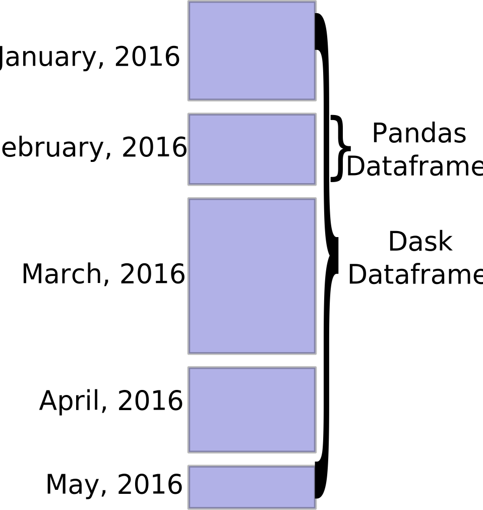

# 数据类型和数据结构

`string`、`tuple`、`bytes`和 `number `是**不可更改的对象**（修改对象的方法返回新的对象），而 `list`、`dict`等则是**可以修改的对象**（可修改当前对象内容）。

**特殊类型**

```python
None						# null
NotImplemented
```

## 数值（Numbers）

### 数值类型

#### 整数（`int`）：

Python3不区分32bit/64bit整数，可以表现任意位数的整数。

Python预定义了一个小整数池`[-5, 256]`，避免整数频繁申请和销毁内存空间。

```python
x.bit_length()   # 整数的位宽
```

##### 字面值

- 二进制前缀：`0b`；
- 八进制前缀：`0o`；
- 十六进制前缀：`0x`；

```python
x = int('0xA2', base=16)
x = 281_028_344  # 数字分隔符
```

整数的字符串表示：`hex(x)`，`oct(x)`。将字符转换为整数`ord(ch)`

#### 浮点型（`float`）：

有小数点或科学记数法表示

```python
y = int(x,[base])   # x 为数值或字符串
y = float(x)        # x 为数值或字符串
complex(real, imag)
```

`nan`和`inf`是特殊的浮点数：

```python
x = float('nan')
y = float('inf')   # -inf: -y 或 float('-inf')
```

> `numpy`中对应的值为`np.nan`和`np.inf`。

#### 逻辑（`bool`）

值为`True`或`False`。整数和浮点数可转换为`bool`类型（非零值为`True`）；

#### 复数（`complex`）

实部和虚部都是浮点型。

```python
a + bj
complex(a,b)
```

### 判断是否为数值类型

```python
from numbers import Number
isinstance(n, Number)
```

### 枚举类型
```python
from enum import Enum, IntEnum, unqiue, auto
Month = Enum('Month', ('Jan', 'Feb', 'Mar', 'Apr', 'May', 'Jun', 'Jul', 'Aug', 'Sep', 'Oct', 'Nov', 'Dec')) # auto-value
```
`Enum`类型成员不属于整数，`IntEnum`的成员可与整数进行比较（标准`Enum`枚举与整数比较返回`False`）。

> 虽然`Enum`由 `class`语法创建，但`Enum`并不是常规的Python 类。

如果需要更精确地控制枚举类型的值（可以是整数以外的值），可以使用`IntEnum`等派生类，或者从`Enum`派生出自定义类：

```python
class Request(IntEnum):
   POST = 1
   GET = 2
   pass
class Perm(IntFlag):
   R = 4
   W = 2
   X = 1
@unique              # 保证枚举值唯一
class Color(Enum):
   RED = 1          # Color.RED.name = 'RED'
   GREEN = 2        # Color.GREEN.value = 2
   BLUE = 3
   YELLOW = auto()
isinstance(Color.GREEN, Color)    # True
```

> 使用自定义类行可以获得类型提示，而使用`Enum`类则没有类型提示。

`IntFlag`类用于表示位类型的标识枚举，同时也继承整数类型。

##### 访问枚举成员

```python
m = Month.Jan       # 显式成员引用
m = Month(1)        # 按枚举成员的值(not index)引用: Month.Jan.value
m = Month['Jan']    # 按枚举成员的名称引用: Month.Jan.name
```

通过枚举成员的名称，可以==将字符串表示转换为枚举类型==。

##### 获取枚举成员的属性

枚举类型的变量有一个字符串名称`name`以及值`value`（整数）。

```python
for m in Month:     # 按定义顺序，而非数值大小
   print(m.name, m.value)
```


## 时间

### 时间类型

时间可以表示为字符串、时间戳、`datetime`（`date`，`time`）以及`time_tuple`（`time_struct`）。

##### 时间戳

Python使用浮点数表示时间戳，单位为秒，精度为微秒（$10^{-6}\mathrm{s}$）。

```python
import time as tm
ts = tm.time()  # return timestamp (seconds)
ts_ms = np.int64(ts*1000) # 毫秒表示的时间戳
```

##### 时间元组（结构）

`localtime()`将时间戳转换为本地时间并返回时间元组`struct_time`；`mktime()`做逆向变换，`tup_time`为表示时间的九元组或`time_struct`。

```python
import time   
struct_time = time.localtime(ts)
ts = time.mktime(time_tuple|struct_time)
```

##### 时间类型对象

时间对象封装了时间戳/时间字段。[Python](https://docs.python.org/3/library/datetime.html)在`datetime`模块中提供多个类构造和[修改](Python数值计算.md#时间日期)时间：

- `datetime`：完整的日期时间信息，精度为微秒（`microseconds`）；
- `date`：仅包含日期部分；
- `time`：包含时间信息，精度为微秒；

```python
import datetime as dt
t = dt.datetime(year, month, day, hour, ..., tzinfo) # datetime object
t = dt.datetime.combine(date, time)  
d = dt.date(year, month, day)  # date object
t = dt.time(hour, minute, second, microsecond, tzinfo)# time object
t = {datetime|date|time}.replace(...) # repalce fields with new value
```

> 构造函数的参数对应了对象中的成员变量。

获取当前日期/时间：

```python
day = dt.date.today()         # [date]
now = dt.datetime.today()     # [datetime]=>dt.fromtimestamp(time.time())
now = dt.datetime.now(tz=None)# [datetime]
now.date()
now.time()
```

Pandas的`Timestamp`类的方法类似于标准库`datetime`类，其底层数据类型为`np.datetime64`。

```python
import pandas as pd
pd_ts = pd.Timestamp(
   ts, unit,  # unit = 'h'|'m'|'s'|'ms'|... ==> pd.to_datetime()
   year,month,day,hour,minute,second,microsecond,nanosecond, # =>dt.datetime
   tz         # e.g. Asia/Shanghai
)
```

> `nanosecond`：其他时间类型精度达不到；
>
> 获取`Timestamp`对象的时间单位`unit`：`np.datetime_data(t.to_datetime64())=>(unit,step)`；
>
> [Datetimes and Timedeltas — NumPy v1.21 Manual](https://numpy.org/doc/stable/reference/arrays.datetime.html)

##### 时间类型转换

将时间日期对象转换为时间戳。

```python
secs = dt.timestamp()     # return timestamp as float
secs = pd_ts.timestamp()  # return seconds
```

没有时区信息的时间日期对象转换为时间戳时视为`UTC+00`时间。

> 如果调用者将`UTC+NN:00`的时间构造为时间对象，但未设置相应[时区信息](#时区设置和转换)，则转换为时间戳会导致时间超前`NN`小时，即`00:00(UTC+NN:00) != 00:00 UTC+00:00 <=> NN:00 UTC+NN:00`。

将时间戳转换为为时间/日期对象

```python
dt = datetime.fromtimestamp()
day = date.fromtimestamp()
```

将日期转换为时间结构：

```python
dt.datetime.timetuple()     # date.timetuple()
```

也可以从[字符串表示构造](#格式化时间)时间日期对象。

#### 时区设置和转换

`datetime`类构造的时间对象默认不包含时区信息（`tzinfo=None`，默认时区为计算机本地时区）。要设置时区，首先构造时区信息：

```python
from datetime import timezone,timedelta
tz_local = timezone(timedelta(hours=8), name='Asia/Shanghai')
```

> `timezone.utc`是内置的时区（UTC+00:00）。

切换时区信息：切换时区不影响时间对象底层的数据，只修改时区信息。

```python
dt_local = t.replace(tzinfo=tz_local)  # <== t.astimezone(tz_local)
```

获取时间对象中的时区信息：

```python
delta = dt_local.utcoffset()   # return offset to utc time.
tz_name = dt_local.tzname()   # get timezone name
```

##### `pandas.Timestamp`类的时区

应尽可能显式设置构造方法中的时区参数，防止数据互操作时解析错误。如果`ts`中也同时包含时区信息，会将其转换至`tz`指定的时区（内部时间戳不变）。

如果`Timestamp`对象初始化时不包含信息或未设置时区参数：

- 从时间戳构造默认时区为`UTC+00:00`（与`datetime.fromtimestamp()`不同），应该将其转换至本地时区使用；
- 从(不包含时区信息的)时间对象或字符串构造默认时区为计算机本地时区，以==与字面值保持一致==（`UTC+08:00`）。

```python
pd_ts.tz_localize('UTC+08:00')    # 导致时间戳减小8小时
pd_ts.tz_localize('UTC')\         # 设置时区信息 UTC+00:00，时间戳不变
     .tz_convert('Asia/Shanghai') # 然后，转换为目标时区（时区名可使用UTC或区域名）
```

`tz_localize()`在时间字面值基础上添加了时区偏移，因此会==修改底层的时间数据（时间戳）==。`tz_convert()`则同时修改时间字面值和时区字面值，因此底层时间数据不变。

> 未设置时区信息的时间是不能转换时区的（*Cannot convert tz-naive Timestamp*），因此必须调用`tz_localize`（类似于`dt.replace(tzinfo=tz_local) `）；已有时区信息的对象则不能再调用`tz_localize`。

#### 时间段

表示由开始和结束时间确定的时间区间。

##### Time Interval

```python
ti = pd.TimeInderval(pd.Timestamp('20210901'), pd.Timestamp('20210903'))
```

##### Time Period

`pandas.Period`表示给定周期的某个时间段，例如1月、1周、1天等；由于具有固定周期，因此可以[与整数进行数值运算](Python数值计算.md#时间周期)实现区间平移。

```python
p = pd.Period(value, freq='M')
p = pd.Period(year=1971, month=1, day=1,..., freq='D')
p = p.asfreq(freq, how='end') # 改变周期，how决定原周期的起点或终点作为新周期的起点
```

> 至少指定`year`（否则返回`NaT`）， 参数`day`对于频率`M`无效。

传递给构造方法的参数可通过对象的属性访问，例如`p.day`。其他属性和方法包括：

```python
p.start_time    # p.strftime(), p.to_timestamp()
p.end_time
```

### 格式化时间

##### 时间对象格式化

上述类型的[时间对象](#时间类型对象)提供`strftime`， `strptime`用于转换自定义格式的时间字符串，格式声明参考[Linux规范](../Linux/Linux配置和管理.md#日期时间)（不支持` %q, %N`）。`isoformat()`用于输出标准格式。

```python
t = dt.datetime.strptime(time_str, '%Y%m%d')
t_str = t.strftime('%Y%m%d')
dt.isoformat(sep='T', timespec='milliseconds')
datetime.fromisoformat(fmt_str)
```

> ISO格式：包括时区信息。

`date`类型未提供转换为`datetime`类型的方法。通过字符串方法可以方便地实现`date`类型到`datetime`类型的变换，或是使用`datetime.combine()`方法将`date`和`time`类型组合构造成`datetime`类型。

`pd.Period`也支持`strftime`方法，将`start_time`转换为字符串。

##### 时间元组（结构）

`time`模块提供的格式化函数在字符串和时间元组之间相互转换。

```python
import time
str_time = time.asctime(st_time) # 格式化输出时间。
str_time = time.strftime(format, st_time)
st_time = time.strptime(str_time, format)
```

##### Pandas Period

除Python默认的格式声明外，[还支持` %f, %F, %q`](https://pandas.pydata.org/docs/reference/api/pandas.Period.strftime.html?highlight=strftime#pandas.Period.strftime)。

## 对象集合

集合类型包括序列类型（列表、元组、字符串）、映射类型（字典）、集合类型等。

##### 统计函数

可应用于所有内置容器类型（包括字典）。

```python
x = max(a)			# built-in max/min in Python, min
l = len(a)			# length of container
```

### 序列类型

#### 字符串（String）

```python
s = 'ilovepython'
```

Python可以使用引号(`'`)、双引号(`"`)、三引号(`'''`或 `"""`)来表示字符串，引号的开始与结束必须的相同类型的。其中三引号可以由多行组成，可以直接包含换行、制表等特殊字符（而无需使用转义字符）；常用于[文档字符串](Python编程基础.md#注释和文档)，在文件的特定地点，被当做注释。

> Python使用了**字符串驻留**技术来提高字符串效率，即同样的字符串对象仅仅会保存一份（长度不超过20），这也决定了字符串必须是不可变对象。

##### 转义序列

| 转义序列 | 实际字符 | 转义序列 | 实际字符   |
| -------- | -------- | -------- | ---------- |
| `\\`     | `\`      |          |            |
| `\"`     | "        | `\' `    | '          |
| `\n`     | 换行     | `\t`     | 横向制表符 |

> 无效的转义序列（例如`'\.'`）不会被处理和丢弃，保持原始输入。

八进制编码：`\0xx`，例如`\000=>NULL`；

十六进制编码：`\xFF`，对应`latin-1`编码字符；

Unicode编码：`\uFFFF`，`\UFFFFEEEE`（Python3中文本被解析为字符串后都是UTF-8编码）；

Unicode 字符串：`u'Hello 世界!'`可直接在字符串字面值输入非ASCII字符。

> 字符编码：`chr(i)`返回Unicode编码（整数`0<=i<=0x10ffff`）对应的字符；`ord(x)`返回字符的Unicode编码。

原始字符串：不解释转义序列：`r'Hello\nWorld!'`（或`R`前缀）。使用`repr(str)`可恢复字符串的[原始文本表示](Python编程基础.md#类的成员)（将特殊字符转换为转义序列）。

变量替换：`s = f'{arg1}, {arg2}'`

可以采用[对象运算符](#对象运算符)对字符串进行拼接、重复和截取等操作。

##### 查找统计

`idx=str.find(sub_str, beg=0, end=len(str))`：`rfind`、`index`、`rindex`，以及[序列类型公共方法](#序列类型公共方法)（`index`）；`in`和`not in`运算符可用于判断字符串是否包含子串。

```python
import operator # operator模块是用c实现的，所以执行速度比python代码快。
tf = operator.contains("hello, python", "llo")
```

`tf=str.startWith(suffix, beg=0,end=len(str))`：`endWith`：`suffix`可以是单个字符串或多个字符串构成的元组（只要其中一个满足即返回`True`）。

> 正则表达式匹配查找使用`re`模块。

`n=str.count(sub_str, beg=0,end=len(str))`：查找字串：返回字串出现的次数。

使用[正则表达式](#正则表达式)。

`is*()`方法：

##### 变换

`sep.join(list_str)`：将字符串拼接起来，并适用字符串`sep`作为分隔符。

`new_str = str.replace(old, new, max_count=-1)`：替换子串。

`new_str=center(width, fillchar)`：类似地`ljust`、`rjust`、`zfill(width)`。

`new_str=str.expandtabs(tabsize=8)`：将`tab`符号替换为空格。

`new_str=str.strip(chars='')`：移除字符串两端`chars`中指定的任意字符，默认为空白字符。`lstrip`、`rstrip`。

`list_strs=split(sep=None)`：默认分隔符为==所有连续==空字符，包括空格、换行、制表符等。`sep`指定的==字符串被视为一个分隔符==，而非将其中单个字符视为分隔符（若需要提供多个分隔符，使用`re.split`）。两个连续`sep`字符串之间会形成一个空的字串。

`list_strs=str.splitlines(keepends=False)`

`new_str=str.title()`：每个单词首字母大写，`capitalize()`、`swapcase()`、`lower()`、`upper()`。

##### 字符串格式化

C-style格式化: 仅在字符串后缀`%`参数时，字符串中的`%`序列才会执行变量替换，否则只是普通字符。

```shell
"... %s ... %04d ..."%(args...)
```

Python-style格式化：其中，`idx`代表参数位置，从`0`开始，没有指定则使用默认参数顺序；位置及关键字参数可以任意的结合。`format`代表格式化参数；`args`为需要被代入字符串的参数； 

```python
"... {} ... {:format} ...".format(args...)
"... {idx} ... {idx.member} ... {idx:format} ...".format(args...)
"... {idx.member} ... {idx[0]} ...".format(args...)
"... {var_name} ...".format(var_name=value)
```

格式化声明：

```shell
[[fill]align][sign][#][0][width][,][.precision][type]
fill        =  <any character>
align       =  {< | ^ | >}[=]
sign        =  +| - | ""   # +表示始终显示符号，-和""表示仅显示负号 
width       =  integer
precision   =  integer
type        =  b|c|d|e|E|f|F|g|G|n|o|s|x|X|%
```

> 对齐方式：“`=`”不能在字符串中使用，在符号位后添加填充（反之在符号位前）；如果需要指定填充，则必须指定对齐方式；位宽前如果存在0，则0作为默认的填充字符。
>
> `#`：为二进制、八进制和十六进制添加前缀`0b,0o,0x`；
>
> `,`：千位分隔符；
>
> `e/E`：科学计数法，`precision`表示小数位数；
>
> `f/F`：定点计数法，固定小数位数（`precision`默认6位），位宽`width`不限制整数部分范围；
>
> `g/G`：使用位宽`width`（包括符号位）、固定有效数字位数`precision`表示。首先按有效数字位数丢弃末尾小数，当在小数部分无法显示足够位数有效数字时，切换为科学计数法（`.precision`表示有效数字位数）。
>
> https://docs.python.org/3/library/string.html#format-specification-mini-language。

##### 正则表达式

正则表达式匹配可用于字符串和[字节序列](#字节序列类型)。

`re.match`：尝试从字符串的**起始位置**匹配一个模式（等效于`^pattern`），否则返回`None`。

> `re.fullmatch`：将模式与整个字符串匹配，相当于使用`^pattern$`。

`re.search`：扫描整个字符串并返回**第一个**成功的匹配。

```python
import re
m=re.match(pattern, string, flags=0)   # startswith(pattern)
m=re.search(pattern, string, flags=0)  # include(pattern)
m.span()     # 匹配位置(m.start(),m.end())  m.pos和m.endpos是原字符串的开始和结束位置
m.group()    # 匹配表达式对应内容=>m.group(0)
m.groups()   # 捕获组：(m.groups()[i]=>m.group(i+1),...)
```

`m.groups() `数量与表达式中声明的捕获组`"(pattern)"`对应。*未成功匹配的捕获组，其捕获内容返回`Null`。*

> ```python
> text=r'试图打印下列文档：D:\Users\gary\Documents\Python数据类型.md'
> pattern=r'(文档：)(.*)(\.\w*)|(文档：)(.*)'
> m = re.search(pattern, text)
> ```

`re.findall()`：查找并返回所有匹配结果。如果模式中不包含捕获，则每个结果括整个匹配内容；反之，返回子串构成的元组。`re.finditer()`返回一个子串匹配对象`Match`的迭代器。

```python
all_matches = re.findall(pattern, string[, pos[, endpos]]) # -> List[str]|List[Tuple[str]]
for m in re.finditer(pattern, text):
  print(m.group(0))
```

`re.sub`：从最左至右替换字符串中的匹配项（最大匹配次数`count`）。

```python
newstr   = re.sub(pattern, replace, count=0, flags=0)
newstr,n = re.subn(pattern, replace, count=0, flags=0)
```

> `replace`可以是一个函数，可基于匹配内容生成替换内容
>
> ```python
> def repl(matched: re.Match):
>     return '\\' + matched.group(0)  # group(0)未整个匹配内容，group(1)为第一个捕获组
> ```

字符串分割：

```python
list_strs = re.split('.|,|:|;| ', string)
```

`re.compile`编译正则表达式并检查语法，生成一个正则表达式` re.Pattern `对象，提供`match`、`search`等方法（与静态方法相同）。

```python
pat=re.compile(pattern[,flag])
```

https://www.runoob.com/python3/python3-reg-expressions.html.

##### JSON

编码和解码：

```python
json.dumps(obj)     # 将Python类型转换为JSON字符串
json.loads(string)  # 将JSON字符串转换为Python对象
```

> 提供`dump`，`load`直接与文件进行[输入输出](Python输入输出.md#JSON)。

##### URL编码

将非ASCII按给定的编码方案进行编码，并将编码结果以十六进制字符表示。

```python
from urllib.parse import quote,unquote,quote_plus,unquote_plus
text = "丽江@2020//"                    
url_code_str = quote(text,'utf-8')   # => '%E4%B8%BD%E6%B1%9F%402020%2F%2F'
text_orgin = unquote(url_code_str,'utf-8')
urllib.request.pathname2url(path)   # url2pathname
```

`quote_plus,unquote_plus`额外将`' '`（空格）替换为`+`。

#### 字节序列类型

==字节序列类型`bytes`和字符串类型有相同的操作方法==；`bytearray`可以修改对象内容。

> [`memoryview`](https://docs.python.org/zh-cn/3.7/library/stdtypes.html?highlight=list append#memoryview) 对象允许 Python 代码访问一个对象的内部数据，只要该对象支持 [缓冲区协议](https://docs.python.org/zh-cn/3.7/c-api/buffer.html#bufferobjects) 而无需进行拷贝。

##### 字符串编码和解码

字符串底层对应了某种编码方案（例如`gbk`, `utf-8`），因此可以使用对应的编码方案实现字符串与字节序列间的相互转换。


```python
s_encoded = s.encode(encoding='utf-8', errors='strict')
b_decoded = b.decode(encoding='utf-8', errors='strict')
```

**乱码**：显示界面与字符串采用的编解码方式不一致。当输出文本到显示界面，实际是将对应的编码序列发送过去，而显示界面需要解码然后进行显示。当显示界面不能成功解码时，可能随机选择某系符号代替错误码字（或者丢弃码字），从而产生乱码。

产生乱码的常见情形：

- 单字节编码方案(如`latin-1`)与`utf-8`不匹配；
- 本地化编码方案（如`gbk`）与`utf-8`不匹配。

在严格模式`errors=strict`下编码生成的字符串对象，只要采用对应的编码方案即可逆变换得到字节序列，并尝试使用其他编码方案以获得正确解码文本。

> *In Python 3, reading files in `r` mode means decoding the data into Unicode and getting a `str` object. Reading files in `rb` mode means reading the data as is, with no implicit decoding, and saving it as `bytes`.*
>
> https://docs.python.org/3/library/codecs.html#standard-encodings
>
> | Codec                | Meaning                                                      |
> | -------------------- | ------------------------------------------------------------ |
> | `raw_unicode_escape` | **编码**：将字符串按`latin_1`方案（单字节）编码。如果字符串中包含其他非`latin_1`范围的码字，则使用转义表示`"\\uXXXX"`和`"\\UXXXXXXXX"`Unicode码点；<br/> |
> | `unicode_escape`     | Decode from Latin-1 ==source code==.<br />解码会处理所有以`\`字符开始的序列，并吸收无效序列。 |
>

##### 推断未知编码类型

`chardet`可根据编码序列特征推断文本最可能的编码类型。

```python
import chardet
chardet.detect(text_bytes)
# {'encoding': 'utf-8', 'confidence': 0.99, 'language': ''}
```


###### 十六进字符串转换

```python
bytes_array = bytes.fromhex('FEF0ABC12')
hex_str = bytes_array.hex()   # str.upper() to uppercase
```

###### 二进制数据的字符编解码

> **[Base64](https://en.wikipedia.org/wiki/Base64)** 将6bit数据映射为8bit，对应于将3字节数据编码为4个码字（合法码字共64个包含`A~Za~z0~9`以及符号`+/`，此外`=`用于填充不在合法码字范围内）[^b64]。

```python
import base64
x = 'this is a string'
x_bytes = x.encode('utf-8')
x_b64:bytes = base64.b64encode(x_bytes:bytes)
x_bytes = base64.b64decode(x_b64) # 输入为bytes或ASCII str
x = str(x_bytes, 'utf-8')    # x_bytes.decode(encoding='utf-8')
```

> 命令行调用：
>
> ```shell
> echo "hell world" | python -m base64
> echo "aGVsbG8sIHdvcmxkCg==" | python3 -m base64 -d
> ```

##### struct

[struct - 廖雪峰的官方网站 (liaoxuefeng.com)](https://www.liaoxuefeng.com/wiki/1016959663602400/1017685387246080)

#### 元组（Tuple）

```python
tup = ( 'runoob', 786 , 2.23, 'john', 70.2 )
```

> 定义元组所用的括号可省略。

元组的元素不能二次赋值（`tup[i]=value`），相当于只读列表。多个元组可以进行拼接（`+`）生成新的元组。

如果元素是可变对象，可以对对象内容修改。

> `(x,)`表示只有一个元素的元组，使用`,`区分元组与普通括号运算符。

展开元组：将元组元素返回到变量中。

```python
x,y,z = (1,2,3)
x,y,*rest = (1,2,...)  # 使用rest接收其他元素
x,y,*_ = (1,2,...)     # 使用*_代替其他任意多的元素
```

> `_`用于替代返回值中不需要接收的数据。

##### zip

使用`zip`将多个序列中的相应元素合并到一个元组中：

```python
l1 = ['bar', 'bar', 'baz', 'baz', 'foo']
l2 = ['one', 'two', 'one', 'two', 'one']
tuples = list(zip(l1, l2))
# [('bar', 'one'), ('bar', 'two'), ..., ('foo', 'one')]
```

> `zip`生成一个元组的迭代器，需要进行类型转换。

#### 列表（List）

列表可以动态添加和删除元素。

```python
li = [ 'runoob', 786 , 2.23, 'john', 70.2 ]
li = [ func(x) for x in iterable if cond(x) ] # cond(x) is optional
li = [ func1(x) if cond1(x) else func2(x) for x in iterable ]
```

> 使用`[]`构造列表[性能更好](https://www.datacamp.com/community/tutorials/python-list-comprehension)。

`range`类型表示不可变的数字序列，通常用于在 `for`循环中循环指定的次数。

```python
class range(start, stop[, step])
```

> 包含`start`，不包含`stop`。

##### 修改列表

```python
l.append(e) # 追加元素。
l.insert(index,e) # 在当前index位置前插入元素
l.remove(e) # 删除第一个值为e的元素（必须在列表中，否则产生ValueError）。
v = l.pop(i=-1)  # => del l[i]
```

##### 合并序列

```python
l.extend(l1)  # 拼接另一个序列
```

> “`+`”运算符将返回新的对象，且只能支持列表合并；`extend()`支持当前对象与任意`iterable`对象合并（等价于`+=`）。

[合并多个序列](#合并多个序列)的方法。

##### 列表排序

`list.sort(key=None, reverse=False)`为列表类型特有的（升序）排序函数，对原列表进行稳定排序操作（*in-place* and *stable*）。`key`为比较参考值，[基于基于排序元素的计算函数](#序列类型公共方法)。

>  Python的排序规则不是通过显式指定比较函数，而是指定排序所使用的参考值。使用以下方法可实现自定义比较函数进行排序。
>
> ```python
> import functools
> def cmp_func(a,b):
>    if a.value > b.value:
>       return 1
>    elif a.value < b.value:
>       return -1
>    else:
>       return 0
> li.sort(key=functools.cmp_to_key(cmp_func))
> ```

为了支持多个字段的排序，可对序列进行多次排序，即按优先级最低到最高的字段分别进行排序（`list.sort`是稳定排序算法，对较高优先级字段的排序时如果值相同不会改变顺序，因此也就不会影响低优先级字段的排序结果）：

```python
from operator import attrgetter
def multisort(xs, specs):
    for key, reverse in reversed(specs):
        xs.sort(key=attrgetter(key), reverse=reverse)
    return xs
multisort(list(objects), (('field1', True), ('Field2', False)))
```

##### Get unique values from a list

https://www.geeksforgeeks.org/python-get-unique-values-list/

1.  Traversal of list `if x not in unique_list`；
2.  Using `set`：`unique_list = list(set(list1))`；
3.  Using `numpy.unique()`；
4.  Using `Series.unique()`。

#### 序列类型公共方法

##### 序列类型的索引

访问元素：

```python
s[idx]
```

> 不能使用列表或元组访问多个元素。

**切片**：从左到右索引默认0开始（***zero-based***）的，最大范围是字符串长度少1；从右到左索引默认-1开始的，最大范围是数组开头。（包含开始不包含结束位置的值）

```python
a[start:end+1]	# 读取从第start到第end的元素
a[start:end+1:step]# i缺省为0 j缺省为L s缺省为1
a[-j:-i]# 读取从倒数第(j-1)到倒数第i的元素: a[-i:-j:1]
a[-i:-j:-s] # 步长为负，逆序读取
a[:]	# all 
a[:-1]  # 从位置0到位置-1之前的数 a[-L:-1:-1]
a[::-1] # 反转操作：-n 读取倒数第n个元素之前的内容
```

> 超出范围的下标自动被忽略。

> 序列类型不能通过整数序列或`bool`序列选取元素（`numpy.ndarray`支持）。

##### 对象操作

使用对象运算符`*`复制序列，使用`+`进行序列拼接。

```python
li = [None]*5  # 构造长度为的序列
s = 'xyz'*5    # 通过复制扩展字符串
```

##### 查找（find）

```python
idx = list.index(value)  # retrun the first occurence
```

> `==`运算符不能用于序列与元素的比较，返回`bool`掩码；`==`直接比较两个对象。
>
> 如果元素不存在，返回异常`ValueError`。

查找多个元素：

```python
L = [1,2,3,2,1,4,5]
R = [1,3]
indices = [i for i in range(len(L)) if L[i] in R]
```

##### 排序

排序结果作为新的对象返回（适用于元组等不能修改的对象）。

```python
sorted(iterable, key=None, reverse=False)
key = lambda x: x[0]
key = lambda x: x.prop
from operator import attrgetter
key = attrgetter('prop')  # 使用对象的"prop"属性进行排序
```

`key`是一个（升序）排序元素的函数，使用迭代器的元素计算排序的比较参考值。`sorted`不支持自定义比较函数（Python3）。

##### 过滤

```python
iterable = filter(func, iterable)  # 过滤序列中func(item)为False的元素
iterable = [item if func(item)==True for item in iterable]
```

> 如果`func=None`，则过滤`item=False`的元素。

##### 迭代

```python
import itertools
```

构造可迭代对象 。

##### 合并多个序列

1. ：按序依次拼接。

   ```python
   # Method1: def concat function with for-loop and concat operator (+)
   def concat(nest_list):
     li = []
     for l in nest_list:
       li.extend(l)			# 合并两个列表
     return li
   l_nest = [[1,2,3], ['a', 'b'], [4]]
   ll = concat(l_nest)
   # Method3: Substitute concat() with reduce()
   from functools import reduce
   ll = reduce(list.__add__, l_nest)	# => lambda x,y: x+y	
   # Method2: List constructor, append by elements
   ll = [y for l in l_nest for y in l] 
   # Method 6 yield from [Python编程基础.md#迭代器] 
   def merge(*lists):
      for l in lists:
         yield from l     # return one element one time from l
   list(merge(list01, list02, list03))
   # Method4:
   import itertools			# use itertools
   flat = itertools.chain.from_iterable(l_nest)
   iterable = itertools.chain(list01, list02, list03) # 可转换为序列类型
   ```

2. 合并且排序

   ```python
   # Method 5
   from heapq import merge
   li = list(merge(li1,li2,li3,...))   # 堆排序算法合并序列，保持序列有序
   ```

   

### 映射类型

#### 字典（Dictionary）

字典当中的元素是通过键来存取的，而不是通过偏移存取。

##### 定义字典

从元素构造字典，或基于已有字典进行构造（合并）。

```python
d = {'name': 'john','code':6734, 'dept': 'sales'}
# ==> d = {**d, **d2}
d = dict(key1=val1, key2=val2, ...) # => d = dict(**d1, **d2) 
d = dict([(key1, val1), (key2,val2), ...]) # <- zip(keys, values)
# ==> d = {k:v for k,v in kv_tuples}
# ==> d = dict(itertools.chain(d.items(), d2.items()))
d = dict.fromkeys(keys, value) # 初始化所有keys的值为同一个value
d.update(d2:dict)  # inplace
```

> Python 3.9支持使用`|`和`|=`运算符进行字典合并。

复制字典对象：

```python
d2 = d.copy()   # 浅拷贝
from copy import deepcopy
d2 = deepcopy(d) # 深拷贝
```

增删字典元素：

```python
d['key'] = value
value=d.setdefault(key, default)
d.update([(k1,v1), ...], k1=v1,...)
del(d['key'])	# 删除字典元素  => del d['key']
value=d.pop(key, default)  # 移除元素，如果key不存在则返回default；
                           # 如果未提供default则产生KeyError
key_val=d.popitem()  #移除末尾元素
dict.clear()  #清空字典元素。
```

遍历字典元素：

```python
for key in dict:		           # => for key in dict.keys()
    print(key, dict[keys])
for key,value in dict.items(): # iter on (key,value) 
    print(key, value)
```

键是不可变数据类型，包括数值、字符串、元组、`datetime`等； 值可以是任意类型。

```python
keys = d.keys()      # return Type <dict_keys>
vals = d.values()    # return type <dict_values>
```

`keys()`和`values()`无法通过下标访问，但可通过迭代访问。

##### 查询字典

字典的`key`是唯一标识，相当于集合类型。可查询`key`是否存在字典中。

```python
tf = key in dc  # => key in dc.keys()
```

##### 字典排序

Python 3.7+的字典保持其元素加入的顺序。可通过重新构造对象实现对字典的排序或使用[有序容器](#有序容器)。

```python
dict(sorted(x.items(), key=lambda item: item[0]))   # sorted by key
dict(sorted(x.items(), key=lambda item: item[1]))   # sorted by value
```

#### NameSpace

> *[A namespace is essentially a collection of names bound to values](https://www.reddit.com/r/Python/comments/3373dm/silly_question_whats_the_difference_between_dict/). They are sometimes **implemented** by a dict "under the hood", but not always, and the implementation detail is really irrelevant, and they're not the same thing.*

```python
from types import SimpleNamespace  
from argparse import Namespace
ns = SimpleNamespace(**kwargs)
ns.varname  # 访问命名空间中的变量
ns.__dict__ # 将命名空间的成员转换为字典
```

> 命名空间中的变量类似于字典的值或类的成员变量（具有类作用域）。

### 集合

`set`对象是由具有唯一性的 [hashable](https://docs.python.org/zh-cn/3.7/glossary.html#term-hashable) 对象所组成的无序多项集。 常见的用途包括**成员检测、从序列中去除重复项以及数学中的集合类计算**，例如交集、并集、差集与对称差集等等。 

```python
s = {'xyz', 123, True}  # 空集合为set()，{}创建的是空字典
s = set('abcdefg')      # 将字符串的字符转换为集合元素。
```

> 集合类型是无序的，其元素顺序与构造时提供的顺序不一定一致。
>
> 使用`in`/`not in`判断集合元素是否存在。
>
> 第三方包`orderedset`和`ordered-set`实现了保持元素顺序的集合`OrderedSet`：
>
> ```python
> from orderedset import OrderedSet   # or from ordered_set
> ```

#### 修改集合

```python
s.add(x)      
s.update(x)   # 参数可以是列表，元组，字典等
s.remove(x)   # 不存在会发生错误
s.discard(x)
s.pop()       # 设置随机删除集合中的一个元素
s.clear()
```

`frozenset`为对应的不可变类型。

#### 集合运算

```python
s = s1.intersection(s2) # 交集：s = s1&s2
s = s1.union(s2)        # 并集：s = s1|s2
s = s1.difference(s2)   # 差集：s = s1-s2, 在s1中但不在s2中的元素
s = s1^s2        # 等效：s1.union(s2)-s1.intersection(s2)
s.isdisjoint()   # 集合是否有没有交集
s.issubset(A)    # 判断s是否为A的子集
s.issubset(A)    # 判断s是否为A的子集
```

> 集合不支持`+`运算符。

[Python 标准库](https://docs.python.org/zh-cn/3.7/library/index.html)

### 容器类型转换

元组：`tuple(s)`；列表：`list(s)`；集合：`set(s), frozenset(s)`。

### 有序容器

`sortedcontainers`包含`SortedList`、`SortedSet`、`SortedDict`等维持元素大小顺序的容器(默认升序)。

```python
sd = SortedDict(func_key, *kv_tuples, **dict_kwargs)  # func_key将key映射为比较值
sd.__reversed__() <==> reversed(sd)
```

`sortedcollections`（基于`sortedcontainers`实现）除包含上述类型外，还包含保持元素加入顺序的类型：`OrderedSet`、`OrderedDict`。

## 矩阵

存储[同类型元素](#数组元素数据类型)的类型，区别于`list`、`tuple`等序列类型。

- Python标准库提供`array`类用于构造[一维数值数组](https://docs.python.org/zh-cn/3.7/library/array.html?highlight=append#array.array.append)。
- NumPy提供`ndarray`(`array`)类用于构建数值数组、`matrix`用于表示矩阵。
- SciPy提供多种类型的[稀疏矩阵](#稀疏矩阵)。

### 多维矩阵

`ndarray`（`array`）类型可表示多维同构（*homogeneous*）矩阵。

#### 属性

| 名称       | 用途                                                         |
| ---------- | ------------------------------------------------------------ |
| `ndim`     | 数组的维数，例如向量为1，矩阵为2矩阵。                       |
| `shape`    | 数组的形状。使用矩阵表示向量：列向量$N\times 1$，行向量默认为$1\times N$，与仅有一个维度的向量类型不同。 |
| `size`     | 数组的元素总数。                                             |
| `dtype`    | [数据类型](https://numpy.org/devdocs/user/basics.types.html)，矩阵元素不仅可以使数值类型，也可以是字符串等类型，但[所有元素类型相同](#从已有数据对象构造)。 |
| `itemsize` | 单个元素的内存占用量。                                       |
| `data`     | 数据的==内存地址==。                                         |
| `base`     | If the array is a view into another array, that array is its `base` |

> `len(array)`返回数组第一维的长度。

##### 数组维度判断

可以`ndarray`以外的类型进行判断：对象维度为0，序列维度为1。

```python
n = np.ndim(x)
shape = np.shape(x)
```

标量：（内置）数值对象、字符串、字节序列等（`np.ndim(x)==0`）；

```python
tf = np.isscalar(x)
```

> 只有一个元素的序列类型、数组类型等返回`False`。非数值对象返回`False`。
>
> `np.isscalar(None)==False`。

#### 元素数据类型

> *Python defines only one type of a particular data class (there is only one integer type, one floating-point type, etc.).* 
>
> *NumPy defines 24 new [fundamental scalar types](https://numpy.org/doc/stable/reference/arrays.scalars.html), mostly based on the types available in the C language that CPython is written in.*
>
> 

内置数据类型定义包括：平台相关类型（`np.int`，`np.float`，...，`np.ubyte,...`，弃用）以及定长类型（`np.int8`, `np.int16` , `np.int32`, `np.int64`, `np.float32`, `np.float64`, ..., `np.bool`，无符号类型：`np.uint8,...`）。

> 

##### 数据类型元信息

在创建矩阵时，`dtype`参数可以为矩阵统一或的每列指定一个名称和类型。`dtype`声明了数据的类型（整数`i/u`、浮点数`f`、对象`O`等）、占用字节数、字节序（little-endian或big-endian）、[结构以及子数组大小类型等信息](https://numpy.org/doc/stable/reference/arrays.dtypes.html)。上述信息封装在`np.dtype`对象中（类似于Python内置的`type`类）。

> Several kinds of strings can be converted. Recognized strings can be prepended with `'>'` ([big-endian](https://numpy.org/doc/stable/glossary.html#term-big-endian)), `'<'` ([little-endian](https://numpy.org/doc/stable/glossary.html#term-little-endian)), or `'='` (hardware-native, the default), to specify the byte order.

```python
dtype.aligment  # 占用字节数
t.kind          # 数据类型（整数/浮点数/...）
t.name          # 类型名（int64）
t.str           # 数据类型规则声明('<i8') -> t.descr
dtype.byteorder # 字节序
```

##### 数据类型判断

可以将数据类型对象与字符串表示进行比较（Pandas数据表的底层类型为`ndarray`，也遵循该规则）。

```python
isinstance(x[0], np.int32)
x.dtype   # dtype('int32')
x.dtype == 'int32'   # return True
x.dtype == np.int32  # return True  >> type(x) == np.int32
x.dtype == int       # return True
x.dtype == '<i4'
```

##### 数据类型转换

```python
train_X = train_X.astype('float32')
```


#### 创建数组

```python
numpy.full(shape, fill_value, dtype=None, order='C')
```

创建指定形状`shape`的数组，并指定初始值`fill_value`和元素类型`dtype`（例如`bool`）。`shape`指定数组的维度，可以是**整数标量**、**列表**或**元组**（`[m,n,p,...]`）。

- 标量：为`0`表示空数组；为`1`相当于标量组成的数组，其他值则为向量；
- 长度为`2`的列表或元组：生成矩阵；
- 大于2的列表或元组：生成高阶数组。

`order`指定数据存储方式： ***row-major (C-style) or column-major (Fortran-style)***。

```python
np.ones(shape, dtype=None, order='C')
np.zeros(...)
```

当采用***C-style***时，最后的维度（`[m,n,p]`中的`p`）索引的元素在内存中是连续存储的；反之，采用***Fortran-style***时，最前的维度索引的元素是连续存储的。==元素在内存中的存储方式对于新创建的数组以及按索引访问数组而言没有影响，但影响数组变形（`reshape`）后元素的排列方式以及切片赋值的效率。==

```
np.empty(shape, dtype=Float, order='C')
```

创建数组，不执行初始化。

##### 等差序列

```python
np.arange(start=0, stop, step=1, dtype=None)
np.linspace(start, stop, num=50, endpoint=True, ...)
```

`arange`创建序列**不包含**`stop`，使用`step`指定步长；`linspace`包含`stop`，使用`num`指定序列元素个数。

##### 等比序列

```python
np.logspace(start, stop, num=50, endpoint=True, base=10.0)
```

该等比序列可以表示为指数形式：$\mathrm{base}^\mathrm{idx}$，其中指数$\mathrm{idx}$对应于等差序列`np.linspace(start, stop, num)`中的元素。如果要生成`(s,t)`之间的等比序列，则先取其对数的等差序列：

```python
nums = np.logspace(np.log10(s), np.log10(t), int(n))
# 等价于
# exps = np.linspace(np.log10(s), np.log10(s), n)
# nums = np.power(10, exps)
```


```python
np.meshgrid(x,y,...,sparse=False,...)
```

###### 对角矩阵

`identity`，`eye`，`diag|diagonal`，`diag_flat`、

###### 三角矩阵

`tri`，`tril`，`triu`。

##### 从已有数据对象构造

```python
np.array(array_like, dtype=None, ndmin=0,...)
```

从已有矩阵或序列对象创建矩阵，==矩阵元素类型默认根据序列对象的兼容类型推导，并对元素进行强制类型转换==。嵌套序列对象可初始化为多维矩阵。

```python
np.array([(1,2,3), (4,5,6)], dtype='i4')
```

当数据中包含混合类型（如字符串与整数），Numpy将自动将数值转换为统一的兼容类型（将整数转换为字符串）。如果要保持原类型，应该声明`dtype=object`。

> 另有其他采用固定选项对`array`方法的封装方法：
>
> - `asarray`：避免兼容类型复制（`copy=False`）；
> - `asanyarray`：避免兼容类型及其子类的复制（`copy=False,subok=True`）；
> - `copy`：总是复制；
> - ...


##### 从数据源创建

###### 读取缓存数据

```python
numpy.frombuffer(buffer, dtype=float, count=-1, offset=0)
```

从字节数组读取数据并创建一维数组。`count`为读取的字节数，`offset`为跳过起始字节数。

###### 读取文件数据

使用`loadtxt`、`genfromtxt`。

##### 其他特殊数组

随机数：`np.random.randn(m, n,...)`

#### 数组对象操作

##### 复制对象

1. 不复制，直接引用

   ```python
   a = b
   a = b[:,idx]
   ```

   通过[切片](#索引和切片)方式获得的数组子集仍然直接引用原数组。

2. 浅拷贝/视图

   对象之间共享底层存储数据的内存，两个对象可对底层数据有不同的表达。

   ```python
   y = x.view(dtype=np.int16, type=np.matrix)  # reinterpret
   b = a.reshape(shape)
   ```

   多数数组操作函数，不必要情况下都不会复制数组内容，而是使用浅拷贝。

3. 深拷贝

   ```python
   a = b.copy()    # list.copy()是浅拷贝
   ```

##### 初始化

```python
a.fill(value)
```

##### 数组变形

`reshape`方法用于重新定义数组的维度，从而方便通过切片方式访问连续元素（如图像数据组成的数组）。该方法仅改变数组的逻辑表示，而不改变数据的实际存储位置（数组底层存储为连续内存区域）。

```python
a.reshape((m,n,...), order='C')  # => np.reshape(a,...)
```

参数为`-1`表示该维度的长度由其他维度和数组元素数量决定（只能有一个维度设置为`-1`）。`a.reshape(-1)`将数组变换为向量，等效方法包括：

```python
a.ravel(order='C')    # => np.ravel(a,...)
a.flatten(order='C')
```

> `a.squeeze()`：隐式降维，移除数组中长度为1的维度。

```python
a.resize((m,n,...))
```

根据新的形状重新分配存储空间，如果数组空间减小则舍弃靠后的元素，反之将新增元素置为0。根据底层存储方式（`C`或`F`）决定元素在内存中的位置。  

```python
np.repeat(a, n_repeat, axis)
```

在给定方向`axis`，对矩阵`a`进行重复。

转置：

```python
a.transpose
```

##### 拼接

将多个数组进行垂直/水平拼接。

```python
np.concatenate((a1,a2,...),axis=0)
np.vstack(list_array)	# vertical concatenate
np.hstack(list_array) # horizontal concatenate (沿行方向拼接，对于1D数组直接拼接)
np.stack(list_array, axis=0) # 在新的维度上拼接数据（维度+1）
```

`list_array`是多个数组组成的序列（**列表或元组**），这里的数组可以是标量、Python序列以及`ndarray`。

拼接方向上各数组长度应该相同。一维数组（向量）与向量/标量只能进行水平拼接。

##### 分割

```
np.hsplit
```

#### 访问数组

##### 索引

访问数组时的下标个数应与声明时的维数（`ndim`）一致。

```python
a[i] # vector
a[i,j], a[i][j] # matrix
a[(i,j)]		# matrix
```

> 元组作为下标将被展开至每个维度，因此长度需要与矩阵维数相同。

##### 切片

对高维数组（例如`3d`）切片时，得到的子数组元素按最低维度连续排列（***C-style***，反之如果是***Fortran-style***，则按最高维度连续排列）。

```python
a[I]	# sub-array, equals to a[i,;] for 2d array or a[i,:,:] for 3d array
A[I,:]  
A[:,J] 
A[I,J] # I/J is a sequece or ndarray-vector
```

> 下标可以是单个元素，也可以是列表，或`ndarray`向量。

##### 迭代

```python
for row in array:  # iterate by rows
  print(row)
for col in array.T: # iterate by columns
    print(col)
for a in array1d:  # iterate by elements
    print(a)
```

##### 更新

```python
a[m:n]=x  # 修改数组内容
a[:]=a+1  # a=a+1 将使a指向新的对象
```

### 结构数组

[结构数组](https://numpy.org/doc/stable/user/basics.rec.html)是特殊的`ndarray`，其每个元素是由不同简单类型构成的元组，元素类型具有统一的复合类型声明。

```python
x = np.array([('Rex', 9, 81.0), ('Fido', 3, 27.0)],
             dtype=[('name', 'U10'), ('age', 'i4'), ('weight', 'f4')])
```

> 其中，`dtype`声明了每个元素的各个字段名称及其类型。

与普通数组一样，可以声明高维数组，但此时元组作为整体不再展开为`ndarray`的元素。

可以使用声明的字段名称访问各元素：

```python
x['age'] = 10    # set all elements' age to 10
```

结构数组可以支持`pandas.DataFrame`的构造。

### 稀疏矩阵

`scipy.sparse`提供稀疏矩阵。

```python
As = lil_matrix(D)	# construct from 2D ndarray
As = lil_matrix(As) # construct from a sparse matrix
As = lil_matrix((M,N), dtype=None) # construct empty matrix with size and type
```

稀疏矩阵类型：

| 类型         | 说明                                                         |
| ------------ | ------------------------------------------------------------ |
| `lil_matrix` | Row-based linked list sparse matrix。<br/>用于==高效地逐步构建稀疏矩阵==，但数值运算效率低，在数值运算前转换为其他类型。 |
| `dok_matrix` | Dictionary Of Keys based sparse matrix.<br/>用于==高效地逐步构建稀疏矩阵==，但数值运算效率低，在数值运算前转换为其他类型。<br/>支持$O(1)$复杂度访问元素，可以高效转换为`coo_matrix`。<br />支持矩阵元素运算。 |
| `coo_matrix` | `ijv`三元组表示稀疏矩阵，==不支持算术运算==，用于稀疏矩阵类型间的快速转换。 |
| `csr_matrix` | 同类型矩阵高效地数值运算；高效地行切片。                     |
| `csc_matrix` | 同类型矩阵高效地数值运算；高效地列切片。                     |

##### Compressed Sparse Row matrix

表示方法（其中一种构造方法）：

```python
csr_matrix((data, indices, indptr), [shape=(M, N)])
```

`data/indices`是一个1D向量，分别按序储存所有行非零元素的值及其列索引；同时，`indptr[i:i+1]`则表示第`i`行非零元素的值与索引在`data/indices`中的位置。由于元素可按行快速索引，因此方便进行高效切片以及按行运算（运算结果需重新构造三个存储结构）。

其他构造方法：

```python
csr_matrix((data, (row_ind, col_ind)), [shape=(M, N)]) # 基于ijk三元组构造
csr_matrix((M, N), [dtype]) # empty matrix
csr_matrix(D) # from dense/sparse matrix
```

##### Compressed Sparse Column matrix

类似于`csr_matrix`。


[保存和加载](Python输入输出.md#保存稀疏数组)


### 数组类型转换

#### `ndarray`转换为其他类型

```python
ndarray.astype(dtype, ...)
```

>  复制数组并作元素类型转换。

```python
list(a)
a.tolist()
```

将矩阵转换为嵌套的列表。

#### 稀疏矩阵转换

稀疏矩阵可以在各类型间相互转换，根据面向的运算类型，选择合适的稀疏矩阵类型。

稀疏矩阵可以转换为常规矩阵。

```python
A = As.todense()   # A=As.toarray(oder=None,out=None)
```


## 表格

### 构造对象

#### DataFrame

```python
df = pd.DataFrame(data=array, dtype=single_type,
                  index=index_label, columns=label_list)
df = pd.DataFrame.from_records(data, columns)
```

##### DataFrame封装的数据类型

`data`可以是`list`、`tuple`、`Series`及其复合类型（如`list_of_list`、`list_of_tuple`、`tuple_of_list`等）以及`ndarray`（支持结构数组）。

- 当数据表示向量时，构造的表格为`Nx1`类型的。
- 当复合类型为字典时，等效于`pd.DataFrame.from_dict(*, orient='columns')`；
- 当字典元素的值为标量时，应为构造函数指定`index=[0]`；

`pd.DataFrame`的`dtype`参数只能为整个表格指定一种数据类型，可在创建后调用`astype`分别设置各列的数据类型。`pd.DataFrame.from_records(...)`可以指定每列的类型。

`DataFrame`内部的数据存储类型为`numpy`数组，其基本数值类型为`numpy`内置类型以及`str`类型。

##### 以字典或列表初始化

```python
df = pd.DataFrame({'col1':values1, 'col2':values2, ...}) 
df = pd.DataFrame.from_dict(
  {'col1': values1, 'col2': values2, ...}, 
  orient='columns'
)
```

字典的键作为表格的行/列索引名，值可以是**序列类型**（`list`、`tuple`、`Series`等），作为表格对应列的数据。`from_dict(...)`将字典的值（序列类型）转换为表格的行（`orient='columns'`，默认）或列（`orient='index'`）。

> 当字典的值为标量，可使用`from_dict(d, orient='index')`得到单列的表格（不支持`orient='columns'`）。

> 如果字典的值为`Series`，则无法指定`orient=index`，可在按列构造后转置。

```python
df = pd.DataFrame.from_records(
  [
    {'col1': v1, 'col2': v2}, 
    {'col1': v1, 'col2': v2}
  ]
)
```

> 每个记录的字段类型可以不同，缺少的字段值未`NaN`。

Pandas也提供将`DataFrame`转换为字典或序列的方法`to_dict(orient='records')`（根据`orient`参数的值决定转换后的对象类型为字典或对象，以及具体的数据结构）。

##### 创建空对象

构造函数不传入数据，但设置行列索引（将行或列索引设置为空）。

```python
index=pd.MultiIndex.from_tuples([],names=['Name', 'IP'])
df = pd.DataFrame(columns=['A', 'B', 'C'], index=index)
```

或将列设置为索引（数据为空，因此索引也为空，但设置了索引名）。

```python
df = pd.DataFrame(columns=['A', 'B', 'C']).set_index(['A', 'C'], drop=False)
```

可向空对象按索引[添加新的行](#追加行)。

##### 读取数据源

表格通常通过从[数据源导入数据](Python输入输出.md#使用Pandas)的方式初始化，例如`read_csv`、`read_parquet`等。

> `read_parquet`需要`pyarrow`或`fastparquet`支持。
>

#### Series

```python
ss = pd.Series(data=None, index=None, dtype=None, name=None, copy=False)
ss = pd.Series(values, index=arrays)
```

一维序列。`copy`表示是否复制输入数据。

> 迭代`Series`对象返回每个元素。`Series`没有列索引，因此不需要传入字典进行初始化。
>
> ```python
> ss = pd.Series([1, 3, 5, np.nan, 6, 8])
> ```

> `pd.Series`不能进行自动hash，因此无法与同样长度的元组进行比较，需要将其转换为元组再比较。

### 数据属性

`shape`：行列数。

`size`：元素总数。

`empty`：==数据表是否为空==。

> `values`：推荐使用 `.array()` or `.to_numpy()`

```python
df.info(memory_usage='deep', show_counts=True)
df.memory_usage(index=True, deep=False)  # sys.getsizeof(df)
```


##### `Series`属性

```python
ss.shape         # 行数
ss.is_monotonic  # => is_monotonic_increasing
ss.is_unique
ss.hasnans
```

#### 列数据类型

`df.dtypes`：每列的数据类型。

```python
y = df.astype(dtype, copy=True)		# 转换整个数据表
# 转换指定列的类型
y = df.astype({col1:dtype1,col2:dtype2,...}, copy=True, errors='raise') 
```

> `copy`和其他方法的`inplace`意义不同，此处总是返回新的表格。
>
> 如果列名和类型分别为序列，首先将其[转换为字典](#定义字典)。

将数据类型转换为支持`pd.NA`的最可能类型。

```python
df.convert_dtypes(
   infer_objects=True,   # 将object类型转换为最合适类型
   convert_string=True,  # 将object类型转换为StringDtype
   convert_integer=True, # 尽可能转为为pandas整数类型
   convert_boolean=True, # 尽可能转为为BooleanDtype
   convert_floating=True # 尽可能转为为pandas浮点数类型（优先转换为整数）
)
df.infer_objects()  # 推断最合适的列数据类型
```

##### 时间日期序列类型

`pd.Timestamp`使用NumPy `datetime64` and `timedelta64` dtypes。[Time series / date functionality — pandas 1.3.0 documentation (pydata.org)](https://pandas.pydata.org/pandas-docs/stable/user_guide/timeseries.html)

> 当对时间类型的列复制为非时间类型数据，如时间文本或时间戳数值，==其结果会自动转换为时间类型==。时间类型字段也可以和时间文本或时间戳数值自动比较。

### 概览数据

可以直接打印（`print`），Pandas根据窗口控件对部分内容进行省略（可以[控制终端显示内容](Python输入输出.md#表格输出)）。

```python
df.head(n=5)		# return the first n rows
df.tail()
print(df.to_string(index=True, header=True))  # remove dtype/header/index info
```

> 终端会自动回显方法返回的值，在脚本中必须使用`print`。

### 索引

#### Index

表示（行/列）索引的数据类型。

```python
index = pd.Index(['e', 'd', 'a', 'b'])
index = pd.Index(list(range(5)), name='rows')
columns = pd.Index(['A', 'B', 'C'], name='cols')
```

`Index`可以被视为特殊类型的`Series`，因此`Series`多数属性、方法也适用于`Index`。

```python
df.index						# 获取DataFrame的索引
index.name          # 索引的名称
index.has_duplicates
index.is_all_dates
```


```python
loc = index.get_loc(key)
```

> Return *int if unique index, slice if monotonic index, else mask*. 

`nan`不影响*unique index*的统计（包含多个`nan`的索引调用`get_loc()`时仍返回的是标量）。


[Index索引的用途总结](https://zhuanlan.zhihu.com/p/86042616)：

- 更方便的数据查询（`df.loc[index]`）；
- 使用index可以获得性能提升：对于唯一的index使用hash表查找，对于有序index使用二分法查找；
- 自动的数据对齐功能（进行序列或表格运算时，非公共的index对应的数据计算结果为`Nan`）；
- 更多更强大的数据结构支持，包括`Categoricallndex`、`Multilndex`、`Datetimeindex`等；

#### 索引类型

##### 数值索引

##### 类别索引

##### 时间索引

`DatetimeIndex`以时间点为数据点。可从时间数据、[周期索引转换](#区间索引)构造、或者按规则构造。从时间数据（[文本表示或时间戳表示](#时间类型转换)）构造索引：

```shell
dt_index = pd.to_datetime(
	ts_data, 
	utc=False,                       # True=>为时间添加时区信息(UTC+00:00)
	unit='s',                        # unit='s'|'ms'|'ns'转换数值类型
	format=None,                     # strftime格式转换字符类型
	exact=True,
	dayfirst=False, yearfirst=False, # 推测格式
	infer_datetime_format=False,     # True->format优先级比自动推测更高
) # 返回值与输入对应： 
# -> list-like: DatetimeIndex
# -> Series: Series of datetime64 dtype
# -> scalar: Timestamp (pd.Timestamp)
dt_index = pd.DatetimeIndex(datetime_data)    
```

`ts_data`为`datetime`类型的数据或表示时间的字符串构成的序列类型。如果原数据未包含时区信息，则[采用默认时区，但无法转换为其他时区](#pandas.Timestamp类的时区)(需要调用`tz_localize`)。`DatetimeIndex`和`PeriodIndex`可直接调用`tz_localize`和`tz_convert`，但元素类型为`Timestamp`或`Period`的序列无法直接调用（需要使用`apply`方法对每个元素分别[转换时区](#pandas.Timestamp类的时区)）。

构造**周期性**时间索引：

```python
datetime_index = pd.date_range(
  start=None, end=None, periods=None, freq=None, 
  tz=None, normalize, name, closed)
```

`start, end`：起始和结束时间（`str|datetime`）；
`periods`：生成的点数；
`freq`：时间间隔，如`5H`。==以上四个参数仅需指定三个==（剩余一个可推测）。

> 单位标识如下：
>
> | 年   | 季   | 月   | 周   | 日   | 时   | 分   | 秒   | 毫秒 |
> | ---- | ---- | ---- | ---- | ---- | ---- | ---- | ---- | ---- |
> | `Y`  | `Q`  | `M`  | `W`  | `D`  | `H`  | `T`  | `S`  | `L`  |
>
> 前缀`B`：仅计算工作时间，默认单位为天（`+MQY`）；`CB`：自定义工作时间；
> 后缀`S`：以周期开始作为记录点（无后缀代表以结束为记录点，`+MQY`）；
> 前缀`S`(semi)：以半周期为记录点（只用于`M`，可与其他前后缀组合使用）。

`tz`：[时区](#时区转换)，缺少时区设置则采用计算机本地时区。
`normalize=True|False`：将起点和终点对齐当天午夜零点。
`name`：索引的列名。
`closed=None|'left'|'right'`：索引区间的开闭，默认为全闭。

##### 区间索引

```python
pd.IntervalIndex.from_arrays(left, right, closed='left|right|both|neither')
pd.IntervalIndex.from_breaks([0, 1, 2, 3], ...)
pd.IntervalIndex.from_tuples([(0, 1), (1, 2)], ...)
```

> `pandas.Interval(left, right, colsed='right')`表示区间，`left`和`right`表示可比较大小的数值类型、`pd.Timestamp`以及`pd.Timedelta`（不支持`dt.datetime`和`dt.timedelta`）。

**时间区间索引**：`PeriodIndex`以==固定周期==的[时间段](#时间段)索引数据。`pandas.IntervalIndex`也可使用`datetime`作为元素表示时间区间。

```python
pi_index = pd.period_range(start, end, periods, freq, name) # ==> date_range
pi_index = pd.PeriodIndex(period_list, freq="M")
```

###### 部分索引

对于`DatetimeIndex`和`PeriodIndex`，可传入`datetime`或`str`表示时间日期的高位部分以索引相应时间的数据。

```python
ss.loc['2020-01']
ss.loc[dt.datetime(2011, 12, 25):]
ss["10/31/2011":"12/31/2011"]
```

时间索引和区间索引的相互转换：

```python
dt_index.to_period()     # <==> pi_index.to_timestamp()
```

#### MultiIndex

通常使用辅助函数创建`MultiIndex`。

```python
from pandas import MultiIndex
MultiIndex.from_arrays(list_of_arrays) # 每个数组为一级索引
MultiIndex.from_tuples(list_of_tuples) # 每个元组为一行索引
MultiIndex.from_product([('a','b'),(1,2),...]) # cross product
MultiIndex.from_frame(...)  # from DataFrame
```

`from_product`适用于多个索引具有层级关系的情况（先给出的索引为高层级，在生成的索引中是连续相同的）。

以上方法的其他参数：

- `names=['first', 'second']`多级索引的名称；使用`index.names`查看索引名称；多级索引的`index.name`为`None`。
- `sortorder=i|None`：指定用于排序的索引级别。

创建`DataFrame`时，可通过`index`参数提供原始数据直接创建`MultiIndex`，或通过`set_index`来创建。

#### 表格索引操作方法

`df.columns`：类型为`Index`，获取或设置列索引名称，`Series`不存在列索引。

`df.index`：获取或设置行索引名。

```python
df.columns = ['A', 'B', 'C', ...]  # 整体修改
df.rename(columns={"A": "a", "B": "c"}, 
          errors='raise'|'ignore', inplace=False) # 替换修改
df.rename(index={0: "x", 1: "y", 2: "z"})  
ss.rename(index='name') # ss.name='Name', 使用标量或hashable序列（元组）修改名称  
ss.rename(index = dict_map_func)  # 修改序列索引
```

设置行列索引的名称（`index.name`或`index.names`）：

```python
df.rename_axis(index='index_axis_name', columns='col_axis_name')
```

> 当存在多个行列标签时，以字典给出新旧名称的映射。
>
> 当打印表格时，行列索引名如果不为空将显示在左上角单元格。

##### 设置索引

使用指定的一列/或多列数据设置为索引。

```python
df.index = data
df.set_index(keys, drop=True, inplace=False)		# 添加新的索引项
```

`keys`：如果为列名，则使用对应列移至索引列，索引列名称为对应列名；如果为与表格长度相同的列（包括`Series`、`Index`、`np.ndarray`、`Iterator`），则设置默认的索引列（无索引列名）；也可以是以上两者组合的列表（设置多重索引）。

`drop`：默认移除作为索引的列，反之移保留为索引的列；

##### 重置索引

设置为数字索引。

```python
df.reset_index(drop=False, inplace=False)				
```

`drop`：默认将原有索引设置为新的列（**首列**），反之移除原有索引；

`inplace`：默认返回新的对象，反之对源对象进行修改。

##### 修改多级索引

移除数据表指定级的索引：

```python
df=df.droplevel(level:Union[int,str,list], axis=0)
```

> `MultiIndex.droplevel`功能相同，返回修改后的索引。

The [`swaplevel()`](https://pandas.pydata.org/pandas-docs/stable/reference/api/pandas.MultiIndex.swaplevel.html#pandas.MultiIndex.swaplevel) method can switch the order of two levels。


### 访问数据

**下标运算符`[]`和成员运算符`.`**：接受标签或切片对象作为参数。

> 使用`.`时，标签/列名需要是合法的Python标识符。

```python
ss = df[colname]			# return Series corresponding to colname
ss = df.<column_name> # column_name必须是合法标识符。
```

> 可以使用列表传递多个列的名称`df_sub = df[names]`，返回表格的子集。
>

`Series`的参数为行索引，而非列名（`Series`无列名）。

```python
x = ss[index_labels]	# return sca lar/Series value via index labels
x = ss.<index_name>
```

#### 访问数据切片

```python
s1 = ss[i:j:s]    # s not included
d1 = df[i:j:s]		# slicing rows
```

> 仅支持`:`操作符构造的参数（与Python规则一致），不支持列表作为参数（会被视为列标签）

##### `loc`属性

参数为标签，或`boolean`向量。

> 提供的参数与数据表标签类型不一致会导致报错。

```python
s.loc[index_labels]				      # Series
df.loc[row_labels,column_names] # DataFrame
```

标签表示方法包括：

- 单个标签：例如`5`、`a`等；

- 序列：`['a', 'b', 'c']`；

- 切片对象：`'a':'f'`、`'d':`等，与下标不同，==`end`包含在内==；

- `boolean`向量

  可以使用`query(expr)`代替`boolean`表达式（不能使用`1`和`0`分别代表`True`和`False`，前者会直接被当作索引处理）。

> `loc`属性和`[]`运算符可以增大数据表，方便增添数据。
>
> `df.loc[row_labels,:]`等价于`df.loc[row_labels]`。
>
> 返回值为单个元素时，如果参数为标量对象则返回标量，如果参数包含列表类型（即使仅有一个元素），则返回值为`Series`。
>
> 返回值为向量时，如果参数为标量，则返回值构成`Series`，反之（即使仅有一列）构成`DataFrame`。

以切片索引访问表格时总是返回表格类型，而当行列索引为标量时，返回值类型会转换为`Series`；以当给定的切片索引范围不在表格内时，对应索引会被忽略；给定单个索引不在表格内则会报错。

```python
x = df.loc[i:j]  # x always be DataFrame
x = df.loc[i]    # x becomes Series if i is scalar
```

##### `iloc`属性

参数基于整数位置（下标，和Python，Numpy的语法一致），或`boolean`向量。

> 参数表示方式对返回值的类型影响与`.loc`一致。

```python
s0 = s.iloc[indices]
df.iloc[row_indices, col_indices]
```

下标表达方式包括：

- 标量整数；

- 整数列表；

- 切片对象；

- `boolean`向量：**查询数据表返回的表达式（例如`df['A']>0`）为`Series`，不能直接用于`iloc`的下标参数**，代替方法可以先将返回值转换为矩阵：

  ```python
  df['A'].to_numpy()>0      # or
  ((df['A'])>0).to_numpy()
  ```

> `ix` is deprecated.

#### 访问单个元素

通过简化下标的判断和处理，访问速度比通过切片接口`loc`和`iloc`更快，仅限访问一行一列的单个元素。

```python
df.at[label, column_name] # s.at[label]  # label based
df.iat[row_idx, col_idx]  # s.iat[index] # integer based
```

#### 多级访问

当传入单个索引时，可仅指定条目的部分索引（编号最小的索引）。

```python
df.loc[l1_key, cols]     # access data with only level-1 index labels
df.loc[(l1_key, l2_key)] # access data with both 2-level index labels
df.loc[(l1_key, l2_key), cols]  # with column labels
df.loc[index, :]         # 使用索引对象访问数据
# .loc does not accept access directly via level-2 index labels
df.xs(idx, level=idx_name)  # direct "read" any index level
```

> *indexing past lexsort depth may impact performance*：当[索引未排序](#索引排序)时可能产生以上警告。

当传入单个索引时，取回内容会**自动去掉传入层级的索引**，因此可以使用链式访问方式：

```python
df.loc[l1_key][cols]
df.loc[l1_key].loc[l2_key]  # chaining access
```

如果要同时访问多个条目，则必须提供每个层级完整的索引。可将索引封装为元组序列，或者将每一级索引单独提供：

```python
df.loc[[(id1,id2,...),(id1,id2,...),...],cols] # list of tuple index
df.loc[l1_idx, l2_idx, :, ...][cols] # separate index
```

当单独提供每一级索引时，不能同时包含列名，因此需要链式访问方式提供列名。

https://pandas.pydata.org/pandas-docs/stable/user_guide/advanced.html

获取部分索引：

```python
idx = df.index.get_level_values(level_name)  # get index of specified level
idx = df.index.droplevel(level_name)  # drop index of specified level
```

获取某一级索引对应的下标：

```python
df.index.get_loc_level(idx)  # return (tf_values, loc)
```


#### 赋值

可以将`Series`对象赋值给`DataFrame`的行或列，无需保证两者的索引一致。

- 仅`Series`对象和`DataFrame`对象的公共索引元素被赋值；
- 未包含在`DataFrame`的索引所对应的元素被忽略；
- `DataFrame`中存在而`Series`对象中不存在的索引赋值为`NaN`。

当赋值使表格[新增行列](#新增行列)时，可以使用字典对表格进行赋值（不能使用字典对已有行赋值，会将字典的键名而非值传递给表格），字典的字段必须与表格行/列匹配。

#### 索引赋值

直接将表格对象赋值给另一个变量是浅拷贝（引用类型默认行为）。

##### SettingWithCopyWarning

> *pandas/core/indexing.py/\_LocationIndexer/\_\_setitem\_\_*
> *pandas/core/indexing.py/\_iLocIndexer/\_\_setitem_with_single_block*
> *pandas/core/generic.py/NDFrame/\_check\_is\_chain\_assignment*
> *pandas/core/generic.py/NDFrame/\_check\_set\_item\_copy*

对`DataFrame`进行索引时返回视图或新对象的情况比较复杂。`pandas`使用内部变量记录下表格（`_is_view`和`_is_copy`）生成的方式，从而在对新对象赋值时给出相应的警告`SettingWithCopyWarning`，从而避免用户对数据进行误操作。

###### 显式链式索引赋值 (Chained assignment)

链式索引赋值的首个索引运算符可能会返回新对象，导致后续的索引赋值运算不会作用在原对象上，这可能与用户的意图不符，因此`Pandas`会给出警告。

```python
df[row_indices][cols]=value
df.loc[row_indices[,col_indices]][cols]=value
```

避免这种警告的方式就是将链式索引更改为`.loc`索引，从而实现一次索引赋值运算：

```python
df.loc[row_slice, cols] = value
```

###### 隐式链式索引赋值

被索引的对象可能是先前代码（或方法传入参数）中通过索引得到的子表格，子表格的构造方式（视图/实例）对于当前代码而言未知（即使用户自己生成的子表格，也难以判断其构造方式）。因此后续的索引赋值也难以判断其是更改的新对象或原始对象，因此`Pandas`会根据内部变量状态给出警告。

> 传入函数的表格对象通常不要对其进行修改，如果有修改应该利用返回值返回，以提示该对象做了修改。

```python
df1 = df[row_indices]   # df2 = df.loc[row_indices]
df1.loc[idx] = value
```

消除警告的方式是用户主动断开隐式的索引链，即在先前代码生成子表格（或传入参数）时进行拷贝。==即如果预计到要对某个子表格做更改，则使用`copy()`方法复制得到子表格，反之则使用索引得到的对象。==

```python
df1 = df[row_indices].copy()   # df2 = df.loc[row_indices]
df1.loc[idx] = value
```

> 索引总是浅拷贝，因为索引为不可变对象，更新索引时总是创建新的对象，所以浅拷贝是安全的。

#### 迭代

按列/行以此访问表格。

```python
for col_name in df:			# iterate column names
  print(df[col_name])
for label, series_column in df.iteriterms():  # df.iterms(), df.iterrows()
  print(label)
  print(series_column)
```

#### 查询筛选

##### 查找

`isin()`查询`Series`或`DataFrame`每个元素是否在指定集合中。

```python
df_tf = df.isin(values:[iterable,Series,DataFrame,dict])
```

> `in`运算符返回前置运算数是否在后置运算数（集合）中。
>
> `==`要求运算对象的维度兼容，而`isin`不限制参数类型。

查找`Series`或`DataFrame`是否包含某个索引：

```python
tf = idx in ss  # => idx in ss.index
tf = idx in df  # => idx in df.columns
```

查找满足条件的行列：

```python
tf_mask = df[col_name]==value # return Series
idx = df.index[tf_mask]		# return index as Index
idx = np.where(tf_mask)[0]    # as ndarray-vector
idx = np.argwhere(tf_mask.to_numpy()).reshape(2)
ss.argmin()   # ss.argmax() 仅适用于数值, see also np.argmin(a)
```

获取满足条件的子表格：

```python
s = df.loc[tf_mask,'colname'] # return filtered value: 
s = df.loc[idx, 'colname']
```

基于标签查找对应元素。

```python
a = df.lookup(row_labels, col_labels) # -> array([df.loc[row_label,col_label]])
```

##### 表达式查找

`df.query(expr)`根据表达式的值筛选表格。表达式语法格式：

- 普通标识符表示数据中的列名，特殊列名使用`` `First Name` ``表示；
- 全局空间中的变量名使用`@var`引用；
- 字面值与Python语法一致；

```shell
s = df.query('col_name=="gary" & value == 10')
```

##### Boolean Reduction

```python
df.all(axis=[0,1,None])  # see also df.any()
df.isna().all(axis=0)  # 判断列是否全为Nan
```

##### 


### 编辑

#### 替换

```python
df.where(df_mask, new_value=nan)# replace with new_value where df_mask is true 
```

> 不像`np.where()`返回下标。

```python
df.replace(to_replace=None, value=None, regex=False, inplace=False, limit=None)
```

`to_replace`：数值类型、字符串、正则表达式（`regex=True`）以及

- 列表类型：与`value`类型长度==兼容==；
- 字典类型：`to_replace.key()`==限定查找的列==，`.value()`为查找的值，`value`参数对应替换内容（字典类型提供其他参数表达方式，但与分参数传递重复）。

`value`：除了普通值外，接受正则表达式中的替换命令。

#### 新增行列

**新增行列开销较大，不适合大型数据表格。**

##### 新增列

```python
df = df.assign(colname=values,...)  # 添加一个或多个新列（colname）
df[new_cols] = values               # scalar|vector|array => df.loc[:, newcols]
```

##### 插入列

```python
df.insert(col_loc, colname:str, value:Union[int,ndarray,Series])
```

`loc`为插入列的位置，`colname`为插入列的名称，`value`为插入列的值。==插入操作更新当前对象==。

==插入操作一次只能插入一列==，如果要插入多列可逐次插入或使用拼接方式。

```python
for col in reversed(new_frame.columns): 
   df.insert(insert_loc, col, new_frame[col])
df = pd.concat([df.iloc[:,:insert_loc], new_frame, df.iloc[:,insert_loc]], axis=1)
```

##### 追加行

```python
df.loc[index]=values          # values可为标量或规格相同的向量
df.loc[index, cols] = values  # 未指定的列值为NaN
```

当指定的`index`不存在于表格时，新增一行；==只能一次新增一行==，尝试提供多个不存在的索引会提示`KeyError: 'Non of [label] are in the index'`。

> 当索引为连续整数，令`index=df.shape[0]`可使==增加的行索引保持连续==；使用`index=-1`将添加`-1`作为索引（而不是在表格末尾自动增加索引编号）。

如果是`MultiIndex`，则不能省略列索引参数（可使用`:`代替列名），否则无法正确识别索引。**注意**：`df.loc[index,:]=values`默认会自动将数值类型转换为`float64`，当新增数据后需要使用`astype`将数据类型转换为预期类型。

`df.loc`在原数据表上修改，`df.append()`返回新的数据表。

```python
df = df.append(other_df_ss_dict, ignore_index=False)  #追加表格、行或字典表示的行
```

当`ignore_index=True`时（重置索引为`RangeIndex`），可以追加一个`Series`或`dict`作为新的行，或追加一个序列的上述对象以追加多行记录。

##### 扩展表格

```python
df.at[row_idx,col_idx] = value # scalar
```

> 可同时扩展多列，但类似于`loc`，一次只能增加一行（即只提供单个行索引）。
>
> `iloc`、`iat`无法新增数据（`out-of-bounds`）。

##### Explode

指定列的元素如果为序列类型，将其展开为多行，同一行其他列的值复制原有值。

```python
df.explode(column:str, ignore_index=False)  # simliar for Series
#            A  B           A  B
# 0  [1, 2, 3]  a  =>  0    1  a   # 将序列元素转换为多行
#                      0    2  a
#                      0    3  a
# 1        foo  b  =>  1  foo  b   # 标量元素不变
# 2         []  c  =>  2  NaN  c   # 空序列变换为np.nan
```


#### 移除行列

##### 按索引移除行列

```python
pd.drop(labels=None, axis=0, index=None, columns=None,inplace=False)
```

`labels`和`axis`组合使用，以确定`labels`代表的是行/列索引；或者可以同时指定`index`和`columns`以删除指定行列。

> `labels`、`index`、`columns`是标量或列表类似结构（不能是元组）。

##### 按索引保留行列

按照给定的索引标签顺序重排表格内容。未给出的索引对应的表格行列将被丢弃，新增的索引对应的行列将填充指定的值`fill_value`。

```python
df_new = df.reindex(labels, axis={'index'|'columns'}, fill_value=nan, ...)  # axis选择行/列索引
df_new = df.reindex(index=idx_labels, columns=colnames, copy=True, ...)  # 直接以关键字给出行列索引
```

> `copy=True`将返回新的表格对象。

##### 移除重复行列

重复行：

```python
tf = df.duplicated(subset=cols, keep='first')
df.drop_duplicates(...,inplace=False,ignore_index=False)
tf = ss.duplicated(keep)
```

`keep='first'|'last'|False`：`first`将第一行以外的重复项标记为True。

移除重复列：将底层数据转职并检查其中的重复行。

```python
df.loc[:,~df.T.duplicated(keep='first')]
```


#### 表格排序

##### 索引排序

按照索引标签对表格的行/列排序：

```python
df.sort_index(axis=0, ascending=True, inplace=False)
```

`axis`指定按行/列排序，`ascending`指定升序/降序。

##### 数值排序

按照行/列的值对表格排序：

```python
df.sort_values(by, axis=0, ascending=True, inplace=False)
ss.sort_values(...)  # 无需指定排序的列，使用数据列排序
```

`DataFrame`的排序参考为表格的一个或多个列，由`by`指定。

判断数据是否有序：

```python
pd.Index(data).is_monotonic   // or Series
```


### 表格对象操作

表格操作只能返回新的对象。

```python
df_t = df.T		# 返回表格的转置
```

#### 拼接

拼接数据表或序列。

```python
df_new = pd.concat([df1, df2, s1, ...], axis=0, join='outer', ignore_index=False,...)
```

`axis`：`0`表示沿行索引方向拼接，`1`表示按列索引方向拼接；==当指定`axis=1`时，`DataFrame`与`Series`可按列拼接==。

`join`：`'inner'`表示取非拼接方向索引的**交集**，`‘outer`表示取索引的**并集**（缺失数据填充为`NaN`）（==只支持两种方式==，其他合并方式使用`merge`或`join`）；

`ignore_index`：如果为`True`则忽略在==拼接方向==上原有的索引，以`0,1,2,...`代替；

`keys`：追加最外层的索引（每个组成表格对应相同的索引元素）。当沿列索引方向拼接时，`keys`将替换相应数据表的列标签。

> 性能问题：创建新的数据表对象设计大量数据复制，因此在进行拼接多个数据表时，首先将数据表组成列表。
>
> ```python
> frames = [ process_your_file(f) for f in files ]
> result = pd.concat(frames)
> ```

`DataFrame.append`方法仅用于**在行索引方向**进行拼接。

```python
df = df1.append(df2, ignore_index=True)
```

> `DataFrame.append`仍**返回拼接后的新对象**，而不像Python列表的`append`方法对原对象进行修改。

[python - Concat DataFrame Reindexing only valid with uniquely valued Index objects - Stack Overflow](https://stackoverflow.com/questions/35084071/concat-dataframe-reindexing-only-valid-with-uniquely-valued-index-objects)

问题：存在列名相同的列。

#### 数据库方式合并

##### merge

根据指定列或索引进行表格合并。

```python
result = pd.merge(left_df, right_df, how='inner', on=None, sort=True, 
                  suffixes=('_x', '_y'))
result_df = pd.DataFram.merge(self, right, ...)
```

`on`：拼接参考列或索引名，需要在两个表中均存在；可以使用多个标签的组合（`on=['key1','key2']`）作为参考。如果未指定参考标签，则两个表的公共列将被作为合并参考关键字。

> `left_on=None, right_on=None`：可以分别指定两个表格的参考列或索引名；
> `left_index: bool, right_index: bool`：使用索引作为参考列。

`how`：合并方法

- `'left'`：使用左侧表的参考列作为合并索引。**如果合并索引的值与右侧对应参考列的一行或多行相等，则进行一对多合并；如果右侧表的参考列不存在对应的值，则合并后右表其他列填充`NaN`；右表未被匹配的行被丢弃。**
- `'right'`：使用右侧表的参考列作为合并索引；
- `'outer'`：使用两侧表的参考列的并集作为合并索引，若索引未在某个表格中匹配到行，则合并结果中该表格对应的列填充`Nan`；
- `'inner'`：使用两侧表的参考列的交集作为合并索引。左右表格中未被索引匹配的行被丢弃。
- `'cross'`： ==**cartesian product**==。

`sort`：按参考标签值进行字典序排序；

`suffixes`：同名的非参考列都会添加到合并结果中。`suffixes`为同名列添加后缀，其中一个可以为`None`，即使用原列名。如果未指定后缀而存在相同列，则自动添加`_x,_y`作为后缀。

##### join

将表格的列或索引与==另一个表格的索引==（*column-on-index*）作为合并的参考。

```python
df_new = df.join(other, on=None, how='left', ...)
```

> `join`不能指定另一个表格的参考列，只能使用索引作为另一个表格的参考列。可已将另一个表格的列首先设置为索引。

### 表格数据类型转换

##### 序列数据转换

Pandas提供方法将标量、列表、元组一维数组或`Series`的数据类型转换，返回`ndarray`或`Series`（输入为`Series`时）

```python
pd.to_numeric(data)
index.to_series()
```

##### 转换为矩阵

`DataFrame`对象如果保存的是同一类型数据，则`to_numpy()`将返回对象的底层数据对象，可**通过底层数据对象修改**`DataFrame`对象。对于异构的数据类型，则返回矩阵的数据类型将适当调整（例如包括整数和`string`类型则返回类型为`object`，如果包含浮点数和整数，则返回类型为浮点型），**返回的数据不是`DataFrame`的底层数据对象**。

```python
a = df.to_numpy(copy=False) # -> np.ndarray
a = df.values               # ss.values, idx.values, recommend using to_numpy()
```

> 将数据对象转换为矩阵。`copy=False`只在必要的时候复制数据。

##### Index

`index`类型可转换为`set`。


## Graph

### networkx

#### 创建图

##### 从空图开始

```python
import networkx as nx
G = nx.Graph(**prop_kwargs)    # nx.DiGraph有向图
```

> `prop_kwargs`为图对象添加属性。

添加节点：nodes can be any [hashable](https://docs.python.org/3/glossary.html#term-hashable) object。

```python
G.add_node(node_obj, prop=value)
G.add_nodes_from([v2, v3], prop=value)
G.add_nodes_from([(node_obj, node_attrs_dict),...])
```

>  当字符串作为`add_nodes_from`的参数时，每个字符将被视为一个节点。

可在添加节点的同时，设置节点的属性（`dict`）。

添加边：添加边的同时也会自动添加节点。

```python
G.add_edge(v1, v2, object=x, weight=1)
G.add_edges_from([(v1, v2), (v1, v3),...])
G.add_edges_from([(v1, v2, edge_attr_dict),...])
G = nx.Graph(edgelist)
```

> `weight`必须是数值类型，提供给需要权重的算法。

移除元素：

```python
G.remove_node(v2)
G.remove_nodes_from([v2, v3])
G.remove_edge(1, 3)   # remove_edge_from()
```

##### 从数据表构造图

如果数据中包含节点和边的属性，可通过以下方式构造。

```python
df_nodes=pd.DataFrame.from_records(data_nodes) # 节点编号和属性数据
df_edges=pd.DataFrame.form_records(data_edges) # 连接编号和属性数据
for idx,n in df_nodes.set_index('id',drop=True).iterrows():
  G.add_node(idx, **n.to_dict())
for idx,e in df_edges.set_index(['head','tail'],drop=True).iterrows():
  G.add_node(*idx, **e.to_dict())
```

如果节点无属性信息，可以通过以下方法从连接表直接构造和导出。

```python
df = nx.to_pandas_edgelist(G, source='source', target='target') # source,target,weight,...
G = nx.from_pandas_edgelist(df)
```

##### 从邻接矩阵构造图

对于只有权重的图，可以使用以下方法通过邻接矩阵构造和导出。

```shell
df = nx.to_pandas_adjacency(G, weight='weight', nonedge=0.0)    # 邻接矩阵
G = nx.from_pandas_adjacency(df)
array = nx.to_numpy_array(G, weight='weight', nonedge=0)        # 邻接矩阵
G = nx.from_numpy_array(array)
array = nx.to_scipy_sparse_matrix(G, weight='weight', format='csr')
G = nx.from_scipy_sparse_matrix(A, edge_attribute='weight')
```

##### 基于已有图构造

```python
G.add_nodes_from(H)  # 从另一个图中添加节点
G.add_edges_from(H.edges)
G = nx.Graph(H)
```

##### 文本数据导入导出

```python
from networkx import json_graph
data = json_graph.node_link_data(G)  # return nodes and links as dict
G = json_graph.node_link_graph(data)
data = json_graph.adjacency_data(G)  # return nodes and adjacent neighbors
G = json_graph.adjcency_graph(data)
```

除了直接按上述方法从JSON数据构造图外，还可将导出的`JSON`数据转换为`DataFrame`，从而得到规范完整的节点和链路信息，可进一步编辑并[构造图对象](#从数据表构造图)。

#### 图的信息

##### 节点信息

节点属性集合是一个字典，可动态修改。

```python
G.nodes              # -> NodeView:Iterable
for n in G.nodes:    # n 是节点的索引，即初始化时传入的节点编号
  print(G.nodes[n])
```

##### 边信息

```python
G.edges                  # EdgeView:Iterable, 
for e in G.edges:        # e为边的索引，即首尾节点编号二元组
  print(e, G.edges[e])   # => G.edges[v1,v2] => G[v1][v2] 边
G.edges([subset_nodes])  # -> EdgeDataView：获取包含给定节点的边集合
```

遍历元素属性：

```python
for (u, v, wt) in FG.edges.data('weight'):
    if wt < 0.5:
        print(f"({u}, {v}, {wt:.3})")
```

##### 邻居信息

```python
G.adj           # -> AdjacencyView: {node:{adj_node:link_attrs,...},...}
G.adj[v]        # <=> G[v] -> AtlasView: {node:link_attrs,...}
G.adjacency()   # -> dict_itemiterator: [(node:{adj_node:link_attrs,...}),...]
G.neighbors(v)  # ->Iterator 邻接表：节点v的邻居列表
G.degree()
G.degree[v]     # <=> G.degree(v) or G.degree()[v]
G.degree([subset_nodes]) 
```

遍历图的信息：

```python
for n, nbrs in G.adj.items():
   for nbr, eattr in nbrs.items():
       wt = eattr['weight']
       if wt < 0.5: print(f"({n}, {nbr}, {wt:.3})")
```

##### 设置图属性

除了构造图时设置属性，也可采用类似字典的方式为图或元素设置属性。

```python
G.graph['day'] = "Monday"
```

##### 设置元素属性

设置节点属性：

```python
nx.set_node_attributes(G, values, name=AttributeName)  # 设置节点属性
nx.set_edge_attributes(...)                            # 设置边属性
```

如果`values`为字典（`{node:value,...}`），则仅设置其中指定的节点为对应的值；否则`values`应该为标量并设置全部节点。也可直接通过访问节点或边设置某一个具体节点或边的属性。

```python
G.nodes[1]['room'] = 714
G.nodes[1]['pos'] = (1,2)
G[1][3]['color'] = "blue"
```

节点位置`pos`属性通常在图可视化中使用，除了已知位置（如地理位置），可[利用布局引擎生成节点位置](https://networkx.org/documentation/stable/reference/drawing.html#module-networkx.drawing.layout)（如[*Graphviz*](Python输入输出.md#使用Graphviz绘制网络图)）。

#### 有向图


## Dask分布式数据结构

提供基于Numpy数组和Pandas `DataFrame`对象等的分布式数据结构，支持本地化分布式并行计算。

### 分布式数据

#### Dask DataFrame

https://docs.dask.org/en/latest/dataframe.html

https://docs.dask.org/en/latest/dataframe-api.html


```python
import dask.dataframe as dd
df = dd.read_parquet("/path/sub*/file*.parquet") # read_csv()
df = dd.from_pandas(
   df_or_ss, 
   npartitions=None, 
   chunksize=None,  # number of rows per partition
   sort=True,       # 首先对数据按索引排序，以获得divisions
   name=None        # 为分布式数据命名（默认名为Hash值）
)
```

> `dask`的读取函数可以使用通配符匹配文件夹和文件。如果数据是从HDFS导出的分片数据，则传入父文件夹将以子文件夹名重建分片参考列。

```python
df.to_parquet(path,
              write_index=True, # 写入索引
              partition_on=None, # 对每个分区按指定列拆分为多个文件
              write_metadata_file=True # 导出元数据(_metadata)到文件
             ) 
```

将每个分区单独写入一个文件。

#### Dask Array

### 数据表操作

多数可执行操作为Pandas API的子集，但行为有所不同。

- `df.reset_index`：与Pandas不同，索引在每个分区中单独设置，因此非单调。
- `df.set_index`：该操作会首先对要设置的索引列进行排序（开销较大；如果指定列已经有序可通过`sorted`参数告知方法避免重新排序）；
- 不支持为行赋值（`df.loc[i,col]=a`出错）；`iloc`仅支持取整列：`df.iloc[:,col_idx]`
- `head(n=5, npartitions=1, compute=True)`：
- `groupby`仅支持对分组后的数据进行汇聚统计，不支持获取分组子表格，不支持以列索引级别分组（`level=`）。
- `to_datetime`：仅支持表格类型的数据转换（需要包含index），如Pandas/Dask的`DataFrame`和`Series`等。
- `df.any(axis=None).compute()`：如果`df`是列为1的表，返回的是长度为1的`Series`，而非标量（`pd.DataFrame`: `axis=None`计算所有元素返回标量）；代替方法转换为`pandas.DataFrame`或转换为`Series`。
- `dask.dataframe`不支持排序操作（分布式运行耗时）。

判断是否[缺失数据](#缺失数据)：Dask仅提供`notnull()`和`isnull()`方法，未实现`isna()`和`notna()`。

##### 数据源

- 不支持限定读取行数（例如`read_csv`不支持`n_rows`参数）；
- `read_csv`不支持设置数据中的列为索引列（设置索引开销较大且会改变数据顺序，可显式调用`set_index`）；
- 

#### 赋值

不支持`df.loc[:,cols]=values`赋值，使用`df.loc[idx]=values`为行赋值。支持行索引和真值访问数据表的一行或多行。

```python
df1 = df.loc[df[col]<10]  # truth value必须为dask类型
```

#### 数据分区

`df = df.partitions[start:end:step]`

`n = df.npartitions`

`df.get_partition(n)`

#### 汇总

```python
df = result.compute()
```

### 最佳实践

##### 使用Pandas

在内存能够容纳数据的情况下，优先使用Pandas，避免并行计算开销。

##### 筛选汇聚数据后使用Pandas

利用条件筛选行列，利用分组统计（`groupby`）进行汇聚后，可大幅减少数据量。

##### 使用索引

可以为`DataFrame`设置一列索引（`set_index`），针对索引列的某些操作将会很快，例如通过排序过的索引查找内容，执行`groupby.apply`等操作。可通过`df.known_divisions`判断数据是否是经过排序的。

```python
df2 = df.set_index(d.timestamp, 
                   drop=True, 
                   sorted=False, 
                   npartitions='auto')
```

> 为`dask.DataFrame`设置索引开销较大(Data Shuffling)，因此应避免频繁使用（使用`persist`），或者将设置索引后的数据表存储到磁盘上供后续使用。
>
> 如果指定列本身为有序的，则设置索引可以快速完成。

##### 避免数据交换（Data Shuffling）

排序、分区(`repartition`)、去重(`drop_duplicates`)、设置索引(`set_index`)等操作需要各分区间进行数据交换。

> *shuffling operations* that rearrange data become much more communication intensive. 

将结算结果缓存（`persist`）在内存中，从而避免重复读取和交换数据等操作。
在单机集群上，由于所有工作节点共存，因此为避免数据缓存占用过多内存，应该首先对数据进行筛选。

```python
ddf = dd.read_parquet(filepath) # Load data from files
ddf = ddf.loc[ddf[colA]==value, cols] # Filter data to a subset
ddf = ddf.set_index('date_time') # set an intelligent index (shuffle)
df = client.persist(df)  # persist data in memory
```

在单机上，如果数据量过大导致无法将内容缓存在内存中，则可以将中间运算结果存储到外部存储。由于Dask采取并行懒加载方式处理数据，后续再重新从外部存储读取并处理数据仍比较快。

##### Repartition to Reduce Overhead

分区大小影响数据交换和Pandas向量化计算的效率。每个分区大小控制在`100MB`左右，而少于100个分区则有利于数据交换。应该控制分区数量（`df.repartition`），使得分区适应内存（小于`1G`），并减少调度节点的处理开销。

```python
df = df.repartition(divisions=None, npartitions=None, partition_size='5MB')
```

> 当数据有索引时，`df.divisions`为分区的索引边界。
>
> `partition_size`为内存占用量，大约为磁盘占用量的2倍。

`repartition`会根据指定参数合并或拆分已有分区。在未指定`divisions`的情况下，[并不能保证各分区大小均匀](https://stackoverflow.com/a/56014192/6571140)。

##### 使用Parquet格式存储数据

https://docs.dask.org/en/latest/dataframe-best-practices.html

https://docs.dask.org/en/latest/dataframe-joins.html

### `dask.DataFrame`类型转换

```python
df.to_dask_array()
dd.to_datetime()
```

## Vaex

|                  | Vaex           | Dask | Pandas |
| ---------------- | -------------- | ---- | ------ |
| **Performance**  | $>{10}^9$ RPS  |      |        |
| **Lazy Compute** | √              |      |        |
| **Memory**       | memory mapping |      |        |
|                  |                |      |        |

 `vaex-core`: DataFrame and core algorithms, takes `numpy` arrays as input columns.

`vaex-hdf5`: Provides memory mapped numpy arrays to a DataFrame.

`vaex-arrow`: [Arrow](https://arrow.apache.org/) support for cross language data sharing.

`vaex-viz`: Visualization based on matplotlib.

`vaex-ml`: [Machine learning](https://vaex.io/docs/ml.ipynb)

`vaex-jupyter`: interactive visualization and selection in the Jupyter notebook and Jupyter lab.

> Vaex依赖Dask。

Instead of making copies, Vaex internally keeps track which rows are selected.

```
df.select(df.x < 0)
df.evaluate(df.x, selection=True)
```

you can also create filtered datasets. This is similar to using Pandas, except that Vaex does not copy the data.

```
df_negative = df[df.x < 0]
df_negative[['x', 'y', 'z', 'r']]
```

##### group-and-compute

```
counts_x = df.count(binby=df.x, limits=[-10, 10], shape=64)
```

二维分组：

```
xycounts = df.count(binby=[df.x, df.y], limits=[[-10, 10], [-10, 20]], shape=(64, 128))
```

##### import data

```python
df = vaex.from_arrays(col_x=x, col_y=y)
vaex.from_pandas(df, name='pandas', copy_index=False, index_name='index')
# Read a CSV file as a DataFrame, and optionally convert to an hdf5 file.
vaex.from_csv(file, chunk_size=None, 
              convert:Union[bool, str]=False,
              **pd_kwargs)
vaex.from_ascii(path, seperator=None, names=True, skip_lines=0)
vaex.open(path,...)
```


```python
to_pandas_df(column_names=None, selection=None, strings=True, virtual=True, index_name=None, parallel=True, chunk_size=None, array_type=None)
to_records(index=None, selection=None, column_names=None, strings=True, virtual=True, parallel=True, chunk_size=None, array_type='python')

export(path, progress=None, chunk_size=1048576, parallel=True, fs_options=None, fs=None)
export_hdf5(path, byteorder='=', progress=None, chunk_size=1048576, parallel=True, column_count=1, writer_threads=0, group='/table', mode='w')
export_arrow(to, progress=None, chunk_size=1048576, parallel=True, reduce_large=True, fs_options=None, fs=None, as_stream=True) # support parquet
export_parquet(path, progress=None, chunk_size=1048576, parallel=True, fs_options=None, fs=None, **kwargs)
export_partitioned(path, by, directory_format='{key}={value}', progress=None, chunk_size=1048576, parallel=True, fs_options={}, fs=None)
export_csv(path, progress=None, chunk_size=1048576, parallel=True, **kwargs)[source]
```

[Introduction to HDF5 (mit.edu)](http://web.mit.edu/fwtools_v3.1.0/www/H5.intro.html#Intro-WhatIs)

##### 可视化

```
df.plot1d(df.x, limits='99.7%');
```

## 参考文献

[^b64]:[RFC 4648: The Base16, Base32, and Base64 Data Encodings (rfc-editor.org)](https://www.rfc-editor.org/rfc/rfc4648.html)

[^dataclass]: [9 Reasons Why You Should Start Using Python Dataclasses | by Ahmed Besbes | Towards Data Science](https://towardsdatascience.com/9-reasons-why-you-should-start-using-python-dataclasses-98271adadc66)

