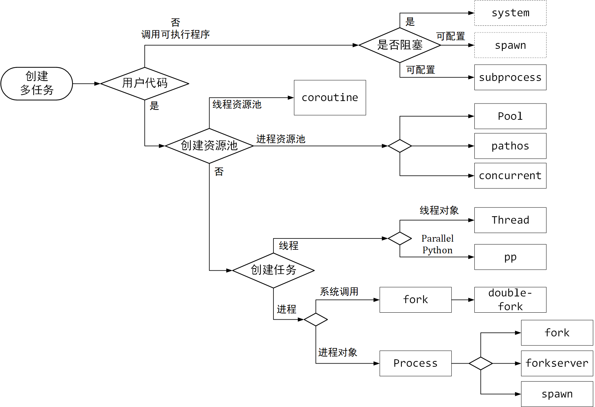

# 系统编程

Python封装与系统底层交互的接口。

- `shutil`：封装Shell命令；

- `os`：封装NT/Posix系统底层接口（部分是跨平台通用接口）；

  > `sys`模块主要封装Python程序的运行环境，非系统接口；

- `socket`：封装系统底层的套接字通信接口；

- `fcntl`：封装Unix的`fcntl`和`ioctl`接口；

- `multiprocessing`和`subprocess`：对多进程接口的高层封装；

- `psutil`：*process and system utilities*，封装了系统监控功能（==非内置库==）；

## 运行环境

### 硬件信息

##### CPU

获取CPU数量：

```python
os.cpu_count()
psutil.cpu_count() # CPU逻辑数量
multiprocessing.cpu_count()
```

统计CPU的用户/系统/空闲时间：

```python
psutil.cpu_times()
```

##### 内存

获取内存容量：

```python
vmem = psutil.virtual_memory() # return total, available, percent, used, free,...
swap = psutil.swap_memory()
```

##### 磁盘

```python
psutil.disk_partition()
psutil.disk_usage('/')   # total, used, free, percent
psutil.disk_io_counters()
```

##### 网络

```python
psutil.net_io_counters()  # 获取网络读写字节／包的个数
psutil.net_if_addrs()     # 获取网络接口信息
psutil.net_if_stats()     # 获取网络接口状态
psutil.net_connections()  # 获取网络连接信息
```

### 用户信息

##### 用户家目录

路径字符串中的`"~"`不会像Shell自动替换为用户家目录路径。

```python
from pathlib import Path			# python 3.5+
home = str(Path.home())
realpath = os.path.expanduser("~/subpath")
```

### Python运行环境

`sys.path`：Python库的[搜索路径](./Python编程基础.md#运行环境)构成的序列；

> 使用`python -m site|sysconfig`可输出路径等信息。

`sys.modules` 是一个字典对象，表示程序当前已加载的模块信息(包括模块所在路径）。   

`sys.version_info`：Python版本信息（`major, minor, micro`）。

`sys.args`：[命令行参数](Python编程基础.md#命令行参数处理)。

##### 系统信息

```python
os.uname()   
# posix.uname_result(sysname='Linux', nodename='WS-GARY', release='5.4.72-microsoft-standard-WSL2', version='#1 SMP Wed Oct 28 23:40:43 UTC 2020', machine='x86_64')
```

> 封装系统`uname`方法并将输出信息抽取到多个字段中。

`sys.platform` ：获取操作系统平台，包括`win32`，`linux`。

##### 系统环境变量

`os.environ`：环境变量字典。

```python
os.environ['USER']       # os.getenv('USER') -> os.path.expanduser *
os.environ['VAR'] = "value"
os.path.expandvars(path) # 展开字符串中环境变量，未知变量不会被展开
```

> `*`：Windows下的用户名变量为`USERNAME `。

##### 工作目录

`os.getcwd()`：直接返回工作目录的绝对路径；`os.curdir`是当前目录的相对[路径标识](# 跨平台路径标识)。

`os.chdir(path)`：切换工作目录。

## 文件系统

### 路径

```python
import os.path as path
p=path.dirname()
p=path.basename()
p = path.abspath(p)  # 绝对路径 (=>realpath)
p = path.relpath(p)  # 相对路径
tf = path.isabs()    # 检查是否为绝对路径
```

拼接路径：

```python
path.join(parent, child)
```

> 如果`parent`为空，则结果为`child`；如果`parent='.'`，则结果为`./child`。
>
> 如果`parent`于`child`之间没有路径分隔符，则添加路径分隔符。

##### 跨平台路径标识

`os.curdir`：当前路径标识，即`.`；使用`path.abspath`返回当前路径的绝对路径；

`os.pardir`：父路径标识，即`..`；

`os.sep`：路径分隔符，Linux中为`/`，Windows中为`\\`；

`os.pathsep`：环境变量分隔符，Linux中为`:`，Windows中为`;`；

`os.linesep`：换行符，Linux为`\n`，Windows为`\r\n`；输出换行符时总是使用`\n`，底层会根据系统自动转换。

`os.devnull`：Linux为`/dev/null`；Windows为`nul`。

### 检查文件/文件夹

```python
from os import path
tf = path.isfile(filename)		# test regular file
tf = path.isdir(dirname)		  # test existing dir
tf = path.islink(filename)    # test symbolic link
tf = path.exists(filename)	
tf = path.ismount(path)       # test mount point(or driver/share root)
```
> `isdir`等效于`exists and not isfile`。

> `pathlib`将路径封装为`Path`对象。
>
> ```python
> import pathlib
> my_file = pathlib.Path("/path/to/file")
> tf = my_file.is_file()
> tf = my_file.is_dir()
> tf = my_file.exists()
> ```


#### 文件信息

```python
s = path.getsize(filename)    # get file size
```

### 管理文件夹

##### 创建文件夹

```python
os.mkdir(dir_path)                    # 父目录必须存在
os.makedirs(dir_path, exist_ok=False) # 父目录不存在则创建父目录，exist_ok防止抛出异常
```

##### 删除文件夹

`os.rmdir(path)`：仅当这文件夹是空的才可以，否则抛出`OSError`。

`os.removedirs(path)`：删除文件夹树（同样也只能删除空目录）。

`shutil.rmtree(path, ignore_errors=True)`：==可删除非空目录==。

##### 列举文件夹内容

列出文件夹中所有内容的名称，不保证文件的列举顺序（对返回列表进行排序）。

```python
contents = [f for f in os.listdir(dirname)]
files = [for f in contents if path.isfile(path.join(dirname, f))]
```

> `os.listdir`返回内容仅包含名称(`basename`)，==不包含路径==。

递归遍历目录：

```python
for dirpath, dirnames, filenames in os.walk():
   for d in dirnames:
      print(os.path.join(dirname, d))
   for f in filenames:
      print(os.path.join(dirname, f))
```

> `dirpath`是当前遍历的目录路径；`dirnames`为当前目录下子目录的集合（不包括`.`和`..`）；`filenames`为当前目录下文件的集合。

### 管理文件

`rename`重命名文件

`remove`删除文件

```python
os.remove(filepath)
```

移动/复制文件：

```python
shutil.copyfile(src, dst) # only file
shutil.copy(src, dst)  # dst can be a folder; use shutil.copy2() to preserve timestamp
shutil.move(src, dst)  # 内部使用copy2进行复制
```

#### 创建临时文件
`tempfile`提供创建临时文件和临时目录的接口，且支持自动创建和清理。

```python
import tempfile
with temfile.TemporaryFile():  
    # NamedTemporaryFile保证可获取临时文件名
    # SpooledTemporaryFile将文件缓存在内存中
    # mode='w+b', encoding=None, newline=None, 
    # suffix=None, prefix=None, dir=None
    pass   # 写入临时文件
with tempfile.TemporaryDirectory(suffix=None, prefix=None, dir=None):
    pass
```

`dir`、`prefix`、`suffix`分别为临时文件/目录所在的父目录，以及临时文件/目录名称的前缀和后缀。
### 文件权限

`os.chmod(path,mode)`

`os.chown(path,mode)`

`os.access(path,mode)`：使用`real uid/gid `测试文件是否具有访问权限（`mode=os.F_OK`测试文件存在；`R_OK|W_OK|X_OK`测试文件的读写执行权限）；

### 监控文件系统变化

使用`watchdog`模块可对文件系统变化进行监控并执行相应处理。

```python
class MyEventHandler(watchdog.events.FileEventHandler): 
   def on_any_event(self, event: FileSystemEvent):
      pass
event_handler = MyEventHandler()
observer = watchdog.observers.Observer()
observer.schedule(event_handler, path, recursive=True)
observer.start()
try:
   while True:
      time.sleep(3)
finally:
   observer.stop()
   observer.join()
```


## 输入输出

### 文件描述符

`os.open(file, flags, mode)`：底层`open`函数；

`os.close(fd)`：

`os.dup2()`方法用于将一个文件描述符复制到另一个文件描述符（必要时先关闭后一个文件描述符）。

```python
os.dup2(se.fileno(), sys.stderr.fileno())
```

### 标准输入输出

`sys.stdout/stdin/stderr` 分别表示标准输入、输出和错误输出的文件对象。    

- `stdin.readline()` 从标准输入读一行；
- `stdout.write("a")` 屏幕输出；

#### 日志

[Python syslog 浅谈](https://www.jianshu.com/p/abb6148c15b4)。

### 套接字接口

```python
s = socket.socket(family=AF_INET, type=SOCK_STREAM, proto=0)
s = socket.create_connection(...)   # => s.connect()
s = socket.create_server(...)
socket.close(s)  # s.close()
```

##### socket对象

```python
conn = s.accept()
s.bind(address)
s.listen(address)
s.connect(address)
s.fileno()  # for select()
s.recv/recvfrom/recvmsg/recv_into/recvmsg_into/recvfrom_into()
s.send/sendall/sendto/sendmsg/sendfile(...)
s.shutdown()
s.close()
```

### IO多路复用

Python `select`库封装了[LinuxIO多路复用接口](../Linux/操作系统原理.md#IO复用接口)，使用`select`、`poll`和`epoll`方法来监听文件描述符状态。

##### select

`select`方法返回就绪的每类文件描述符，用户需要对描述符的状态进行查询（`sock_poll`）。

```python
r,w,x = select.select(rlist, wlist, xlist, timeout=None, /)
```

> `Windows`仅支持`select`方法监听`socket`。

`rlist`：读取准备就绪的文件描述符列表；

> 文件描述符是`socket`、文件对象或文件对象的`fileno()`方法返回的整数值。

`wlist`：写入准备就绪的文件描述符列表；

三类文件描述符中不需要监听的将对应参数设置为空列表（`[]`）。

##### epoll

使用`epoll`的程序通常会执行以下步骤：

1. 创建一个`epoll`类型对象`epl`

2. 让对象监听指定文件描述符上的上的指定事件

   ```python
   epl.register(fd, select.EPOLLIN)
   ```

3. 轮询所有监听的文件描述符

   ```python
   events = epl.poll(timeout=None, maxevents=-1)
   ```

   > `timeout=None`则等待直到其中某个文件发生监听事件，`maxevents`表示最大返回事件数，默认无限制。

4. 基于轮询结果确定发生事件的文件及其对应的事件，从而执行相应的文件读写操作，然后修改相关文件的监听状态

5. 重复上述过程，直到程序推出前销毁`epoll`对象。

以下给出了使用套接字的示例：

```python
import select 
EOF = b'\n\r\n'   # End of Request
epl = select.epoll()       #: 创建一个epoll对象
epl.register(serversocket.fileno(), select.EPOLLIN) # 注册socket读事件
while True:
  events = epl.poll(0.1)  # 等待0.1s进行轮询
  for fn, event in events:
    if fn == serversocket.fileno(): # accept new connection
      connection, address = socket.accept()
      connection.setblocking(0)   # 将新的socket设为非阻塞并注册读事件
      epl.register(connection.fileno(), select.EPOLLIN)
      # 记录连接对象和文件描述符的映射
      connections[connection.fileno()] = connection # dict
    elif event & select.EPOLLIN:
      # 对发生读事件的socket读取数据
      requests[fn] += connections[fn].recv(1024)
      if EOR in requests[fn]:
        print(requests[fn]) # 处理客户请求
        # 注册写事件（EPOLLOUT），响应客户端请求；
        # 如果用户还有后续输入，则使用epl.register()
        epl.register(fn, select.EPOLLOUT)
        # 反之将注册时间修改为EPOLLOUT
        eplmodify(fn, select.EPOLLOUT)         
    elif event & select.EPOLLOUT:
      # 当套接字准备好发送新数据（可能之前有数据还未发送完成需要等待）
      # 每次向客户端发送一定长度的响应内容，每次都更新余下待发送的响应内容
      byteswritten = connections[fn].send(responses[fn])
      responses[fn] = responses[fn][byteswritten:]
      if len(responses[fn]) == 0:
        epl.modify(fn, 0)  # 单次响应：完成服务，不再监听事件，关闭连接
        close_connection(fn, socket.SHUT_RDWR);
        # 如果是多次响应的服务，则使用epl.unregister()暂时取消输出就绪查询,
        # 直到再次接收到数据或用户发送EOF指令或用户断开连接。
        if requests[fn].endswith(EOF): 
          close_connection(fn, socket.SHUT_RDWR)
        else: 
          el.unregister(fn, select.EPOLLOUT)
    elif event & select.EPOLLHUP: # HUP（挂起）表明客户端断开了连接
      epl.unregister(fn)
      close_connection(fn)
epl.unregister(serversocket.fileno())
epl.close()
serversocket.close()
```

当一个连接中由多个请求需要处理时，需要在输入流中添加分隔各请求的序列`EOF`（例如非文本的特殊字符`\n\r\n`）；从而在服务器接收信息后检查请求接收完成并注册`EPOLLOUT`事件进行响应输出。`EOF`不应在请求内容中出现。

> 等待输出准备完成：当并发数量较大时，多个输出Sockets将共享网络输出，使得输出数据消耗较慢，一个Sockets在完成输出并就绪之前可能收到新的输出请求，此时该Sockets将等待输出准备完成。
>
> ```python
> def close_connection(fn, socket_opt=None):  # 服务端关闭连接，释放资源
>   if socket_opt is socket.SHUT_RDWR:
>       connections[fn].shutdown(socket.SHUT_RDWR)
>      else:
>       connections[fn].close(socket_opt)
>      del connections[fn], recv_buffer[fn], send_buffer[fn]
>   ```

**Edge Triggered**只在文件状态变化时通知应用。

管道IO：假设需要从输入流`fd_read`读取数据并写入输出流`fd_write`，其中一个没准备好都不能完成读写。如果使用LT模式（Level Triggered），则在两者全部准备好之前会持续收到其中已准备好的文件的通知，从而浪费资源。在ET（Edge Triggered）模式下，在收到某个文件准备好的通知时，记录其状态，当所有相关文件状态都就绪时，进行读写操作直到返回`EAGAIN`，然后重置状态进入下一次读写准备阶段。


[select、poll、epoll之间的区别总结 - Rabbit_Dale - 博客园 (cnblogs.com)](https://www.cnblogs.com/anker/p/3265058.html)。

### 非阻塞IO

设置非阻塞IO：`read()`方法仅读取流中已有数据，并立即返回。为文件描述符添加`os.O_NONBLOCK`标识。

```python
import fcntl
old_flags = fcntl.fcntl(f.fileno(), fcntl.F_GETFL)
fcntl.fcntl(f.fileno(), fcntl.F_SETFL, old_flags | os.O_NONBLOCK)
```

> `fcntl`仅支持Linux。Windows上仅支持套接字的非阻塞模式（系统调用`socket.ioctl(control, option)`）。

非阻塞方式通常与[IO多路复用](#IO多路复用)或[异步接口](#异步IO)结合使用，从而保证相应文件准备好读写内容。

`socket.SOCK_NONBLOCK=>s.setblocking(False)=>s.settimeout(0.0)`

## 多任务执行

多线程共享代码、内存数据，用于**输入输出密集型**（*IO-bound*）任务并行；多进程具有独立的代码、内存空间，用于**计算密集型**（*CPU-bound*）任务的并行。

### 线程

`threading`将线程封装为`threading.Thread`类。

```python
th = threading.Thread(traget=func_my_thread, args=(args,))
class myThread(threading.Thread):  # 支持继承`threading.Thread`类：
  def __init__(self, target, *args, **kwargs):
    threading.Thread.__init__(self, target, *args, **kwargs)
    # do customized init
    pass
 	def run(self):
    # thread code
    pass
th = myThread(args) # 创建线程
```

CPython（Python解释器）设置了[全局解释器锁GIL(Global Interpreter Lock )](http://cenalulu.github.io/python/gil-in-python/)，导致多线程中仅有一个线程获取到互斥锁，因此==无法实现真正地多线程并行执行。但多线程能够切换，因此能应用于I/O密集型任务避免IO阻塞==。基于C扩展的模块，例如`numpy`、`pandas`在调用内部C代码时不受GIL限制，因此能够实现并行。

> `thread`提供了低级别的、原始的线程以及一个简单的锁。`thread`模块已被废弃。用户可以使用`threading`模块代替。为了兼容性，Python3将 `thread`重命名为"`_thread`"。
>
> ```python
> import _thread as thread
> thread.start_new_thread(func_thread, args)
> ```

##### 线程信息

`threading.currentThread()`：返回当前的线程变量（同`current_thread()`）。

`threading.main_thread()`：返回主线程信息。

`threading.enumerate()`：返回当前进程包含正在运行的线程的列表。

`threading.active_count()`：活动线程数量（`activeCount`）。

`th.setName(name)`：设置线程名。`th.getName()`获取线程名。

> `th.name`。
>
> `th.ident`：线程ID；`th.native_id`：内核返回的线程编号，与`ident`不同。
>
> `th.daemon`：是否为守护线程（`th.isDaemon()`，仅当守护线程退出时整个程序才完全退出），新线程继承父线程的守护属性（默认为`False`）。

#### 线程调度

```python
th.start()     # 启动线程
th.join(time)  # 等待线程结束或超时
```

> 根据`th.is_alive()`判断线程是否已结束运行或超时。

可在全局空间中声明一个对应线程的停止标识，当目标线程检测到该标识后，主动退出（从线程函数返回），而非从其他线程[强制停止该线程](https://www.geeksforgeeks.org/python-different-ways-to-kill-a-thread/)。

> 强制停止线程可能导致线程申请的资源未正确释放。

#### 线程同步

##### 互斥锁

互斥锁变量可作为全局变量或作为参数传递给线程，多个线程可尝试申请互斥锁的使用权避免共享资源竞争。

```python
lock = threading.Lock()
lock.aqcuire()
lock.release()
```

参考[进程同步原语](#进程同步)。

Python的`queue`模块中提供了同步的、线程安全的队列类，包括`Queue`（FIFO)，`LifoQueue`（LIFO），和优先级队列 `PriorityQueue`。这些队列都实现了锁原语，能够在多线程中直接使用，可以使用队列来实现线程间的同步。

https://harveyqing.gitbooks.io/python-read-and-write/content/python_advance/python_thread_sync.html

### 创建进程

在Unix系统中，创建进程包括两种方式：

- 复制进程并共享代码空间，子进程与父进程执行不同的代码块；
- 替换（复制）进程，子进程执行其他文件内容。

Python提供上述两种方式的系统接口封装，并提供了抽象的类型封装。父进程可选择阻塞等待子进程执行结束或启动子进程后立即返回。

#### 系统接口

[`os.fork()`](../Linux/Unix环境高级编程.md#创建进程)复制当前进程创建新进程（Unix-Only）。

`os.system()`封装了标准C函数`system()`，启动一个shell环境（子进程）执行命令，并返回命令的完成状态。命令的输出将合并到当前进程。

```python
n = os.system('ls -l /home/user')  
# >>> sh -c ls -l /home/user  # -c read argumments as commands
```

> Python封装了许多系统程序接口（`os`库），可直接访问这些Python接口函数，而无需使用`system()`函数调用shell命令。

[Inheritance of File Descriptors os — Miscellaneous operating system interfaces — Python 3.9.5 documentation](https://docs.python.org/3/library/os.html#inheritance-of-file-descriptors)

##### 进程信息和控制接口

```python
os.getpid()
os.getppid()
os.kill(pid, signal.SIGTERM)
```

```python
(repid, status) = os.waitpid(pid, options=0)    # 等待任意一个子进程结束
(repid, status) = os.wait()      # 等待任意一个子进程结束
(repid, status, resinfo) = os.wait3()
(repid, status, resinfo) = os.wait4(pid,options)
siginfo = os.waitid(os.P_PID|os.P_PGID|os.P_ALL, id, options) 
```

> 如果`pid=0`，获取当前进程所在进程组的任意子进程的状态；如果`pid=-1`，则等效于`wait()`；*如果`pid<-1`，则获取进程组`|pid|`中任意进程的状态（可能应该是当前进程所在进程组）。*在Windows上`pid`只能是正数，且不需要是一个子进程。

`options`：`os.WNOHANG`（Unix）：立即返回，如果没有子进程终止，则返回`(0,0)`；

`status`：16位整数，低字节为终止进程的信号，高字节为返回值（信号为0）。如果产生core dump，则信号字节的最高位被设置（`waitstatus_to_exitcode()`）。

通过`psutil`可以获取到所有进程的详细信息：

```python
psutil.pids()
psutil.test()              # 模拟shell的ps命令
p = psutil.Process(3776)   # 获取指定进程ID=3776的信息
```

通过`psutil.Process`可访问进程相关的信息。

#### 共享代码的进程类型

`multiprocessing`库提供`Process`类创建子进程并运行指定代码（使用`Pool`创建[进程池](#进程池)）。

```python
p = Process(target=func, name='ProcName', args=(), kwargs={}, daemon=None)
p.start()   # 启动进程
p.join()    # 等待并清理进程
```

调用`p.start()`启动子进程，子进程的运行函数为`p.run()`，其默认调用初始化的`target()`。父进程记录子进程信息后从`start()`方法返回（**非阻塞模式**）。

> 可继承`Process`并重载` Process.run()`方法，添加子进程初始化以及清理代码。

**阻塞模式**：父进程在启动子进程后可调用`p.join()`阻塞等待子进程结束。

> 使用`Process`创建的进程在子进程退出前不会主动退出（等效于退出前调用了`join()`）。==如果子进程是不会退出的服务，则主进程会阻塞而无法结束。==

##### 进程启动方法

```python
import multiprocessing as mp
if __name__ == '__main__':
	mp.set_start_method('spawn')   # 在main中设置默认进程创建方法，不能调用多次
   mp.set_executable(PYTHON_PATH) # 设置运行子进程的Python解释器路径
```

- `spawn`：父进程启动一个**全新的Python解释器进程**。子进程只会继承那些运行进程对象的 [`run()`](https://docs.python.org/zh-cn/3/library/multiprocessing.html#multiprocessing.Process.run) 方法所需的资源，不必要的文件描述符等不会从父进程继承。使用此方法相对其他两种方法较慢但最可靠，Windows的默认设置。

- `fork`：使用`os.fork()`复制Python解释器，因此子进程启动时与父进程相同，父进程的所有资源都由子进程继承。Unix中的默认值（仅UNIX可用）。==为了减少进程创建开销，应该使父进程尽量轻量，即避免在父进程中创建不必要的资源==。

  > 避免对具有多线程的进程执行复制操作，`fork`系统调用是面向单线程进程的，只有地址空间被复制，线程不能被继承。

- `forkserver`：首先启动一个轻量的`server`进程（通过`spawn`方法创建），当需要创建进程时，复制`server`进程而不是当前进程。可在Unix平台上使用。*使用`context.set_forkserver_preload([modules])`为`server`进程[预加载部分模块](http://www.bnikolic.co.uk/blog/python/parallelism/2019/11/13/python-forkserver-preload.html)（`modules`将会在主进程和`server`进程分别被导入一次，后续复制`server`进程是直接复制内存空间所以不会再加载模块）。*

  > `server`进程为单线程，因此使用`os.fork()`时是安全的。

> 在`Unix`上使用`spawn`或`forkserver`方法还会启动一个资源追踪进程（resource tracker process），以追踪由进程创建的未连接的命名系统资源（例如命名信号量或共享内存对象）。当所有进程退出后，该追踪进程释放追踪的资源对象。如果一个进程被信号终止而未及时释放上述资源，可能导致资源泄漏。

可以在同一个程序中建立多个上下文（Context），以使用不同的进程启动方法。`get_context()`返回`Context`对象并提供与`multiprocessing`模块相同的接口。

```python
ctx = mp.get_context('spawn')
q = ctx.Queue()
p = ctx.Process(target=foo, args=(q,))
p.start()
```

1. Python forkserver and set_forkserver_preload()：http://www.bnikolic.co.uk/blog/python/parallelism/2019/11/13/python-forkserver-preload.html

##### 进程属性

- `ident`和`pid`：进程ID。

- `authkey`：当`multiprocessing`初始化时，主进程被分配的一个随机字符串；当进程被创建时继承父进程的`authkey`（可以手动修改该字符串）；

- `Process.name`

- `Process.exitcode`：进程退出代码；

- `Process.daemon`：必须在调用`start()`前设置（该值继承自父进程，并可以通过构造函数设置）。**注意**：`daemon=True`的进程不是UNIX守护程序或服务，其不再被允许创建子进程，父进程退出前会主动结束并清理此类进程。

- `mp.current_process()`：返回当前进程。

- `mp.active_children()`：返回活动子进程列表。

- `mp.parent_process()`：获取父进程。

- `is_alive()`：进程是否存活；

> `start`, `join`, `is_alive`, `terminate`和`exitcode`仅应该再父进程中被调用。

##### 进程控制

- `terminate()`：中止进程，发送`SIGTERM`信号（Linux）或使用`TerminateProcess()`（Windows）；进程立即退出，不会调用退出处理程序和`finally`语句块。`kill()`与`terminate()`一样，但发送`SIGKILL`信号；

`p.join(timeout=None)`：**合并**子进程并清理子进程资源；

> 进程不能在自己的进程中调用`join`（会形成死锁，不允许这样调用会产生错误）；
>
> `join()`不会返回进程退出状态，检查`exitcode`确定子进程的退出状态；
>
> 已结束但还未合并的进程变为僵尸进程。每次新建子进程，调用`active_children()`或调用已完成进程的`is_alive()`方法时，所有已完成的子进程会被自动清理；仍然建议尽可能手动合并子进程。
>
> ==如果父进程可能先于子进程退出，则应该在父进程中调用`join()`等待子进程退出，防止子进程变成僵尸进程后不会再被合并==。当一个子进程需要持续运行时，父进程调用`join()`来合并该子进程会导致阻塞而无法继续工作，令`daemon=True`可自动在主进程结束前尝试结束所有`daemonic`子进程防止其变为僵尸进程。

#### 执行文件的进程类型

` subprocess`库提供方法在子进程中运行文件，用于替代`os.system(), os.spawn*()`。最常用的模式为接口为`run()`：给定执行命令与参数，在给定时间内等待子进程执行完成并获取其输出内容和返回值。（**如果子进程需要脱离前台进程运行**，则需要调用`Popen()`方法自定义与子进程的交互过程）。

> `run()`等效于调用`Popen()`、`communicate()`和`wait()`。
>
> - `timeout`，`input`传递给`communicate()`；
> -  `check`, 和`capture_output`外，其他参数都传递给`Popen()` 。

```python
import subprocess as sp
sp.run(args, *,               
       input=None,            # True => stdin=sp.PIPE
       capture_output=False,  # True => stdout=sp.PIPE, stderr=sp.PIPE
       timeout=None,
       check=False,           # True => can raiseCalledProcessError
       stdin,sdtout,stderr,
       shell=False, 
       cwd=None
       text,                  # True => 文本模式
       encoding,              # 使用文本模式并指定文本编码
       errors,
       env,                   # 环境变量字典
       **popen_kwargs) -> sp.CompletedProcess # 返回进程结束状态
```

`args`：命令行参数为字符串或参数序列。在Windows上，参数序列将被转换为字符串传递给[底层进程创建函数](#使用Popen创建子进程)；在Linux上，==如果为字符串则整体视为执行的命令（不含参数）；如果为参数序列，则首个参数为可执行命令，其他为该命令的参数==。

`shell=True`：创建并使用Shell解释执行命令。在Linux上，如果传递的是参数序列，则首个参数作为Shell的命令输入（类似于命令行上输入的所有内容），**其他参数作为Shell环境的参数**；

> 在Linux上需要设置`shell=True`的情况，
>
> - 需要对执行命令的Shell设置参数；
> - 命令中包含非命令参数的字符，例如==通配符、管道和重定向==运算符。
>
> 在Windows上，参数表示方式对执行方式没有影响。但某些命令内置于shell中（如`dir`），因此需要设置`shell=True`使用Shell来解释命令以及参数，以免产生`FileNotFoundError`。

##### 进程间输入输出

默认子进程与父进程使用相同的标准输入输出流，无法捕获输出内容。可以将子进程的标准输入输出重定向到文件或者管道。

- 管道：`sp.PIPE`表示创建一个连接到子进程的管道；
  - `stdin=sp.PIPE`：[父进程可以输入信息到子进程的标准输入](#自定义输入输出交互流程)；
  - `stdout=sp.PIPE`：父进程可以从子进程的标准输出读取信息；
  - 合并标准输出和标准错误输出：`stdout=sp.PIPE`和`stderr=sp.STDOUT`；
- `sp.DEVNULL`将输出内容丢弃。
- 其他合法的文件描述符。

如果使用文本模式，则 `stdin`、`stdout`和 `stderr`传递字符串；反之为字节流模式，使用`bytes.decode('utf-8')`方法将输出的字节数组转换为字符串，以及`str.encode()`将字符串转换为输入的字节数组。

> `Windows`终端默认编码是`GBK/GB2312`。

**返回值**：包含了命令行参数`args`（传递给`run()`方法的）、返回值`returncode`、捕获的标准/错误输出数据`stdout/stderr`（`capture_output=True`）等。

```python
proc = sp.run(['ps', '-ef'], capture_output=True, text=True)
print(proc.returncode)
print(proc.stdout)
```

>`os.popen()`由`sp.Popen()`实现，执行命令并捕获输出内容（相比于`sp.run()`，==不会返回命令的返回值==，捕获的标准输出和错误输出合并）。
>
>```python
>stream = os.popen('echo ps -ef')   # 返回标准输出的错误输出的流
>output = stream.read()  
>for r in stream.readlines(): print(r)
>```

##### 使用`Popen`创建子进程

```python
proc = sp.Popen(args, *, bufsize, executable, ...) -> sp.Popen
```

> Linux上使用类似`os.execvp()`的方式创建子进程；Windows上使用`CreateProcess()`函数。
>
> `executable`指定命令以代替`args`中的命令（如果`shell=True`，则代替shell；原来的命令作为进程的名称）。
>
> 返回值封装子进程相关信息（参数、输入输出流、pid、返回值），后续调用可更新该对象。
>

非阻塞执行：子进程创建后立即返回，使用`proc.poll()`查询命令执行状态（储存在`proc.returncode`），程序执行完成前返回`None`；

阻塞执行：调用[`wait()`方法](https://docs.python.org/3/library/subprocess.html#subprocess.Popen.wait)等待子进程结束并清理子进程。

```python
process.wait(timeout=10)  # [except TimeoutExpired] 等待和回收子进程
```

> 子进程结束后，需要在父进程中回收资源，避免子进程成为僵尸进程，浪费系统资源。

**终止进程**：

```python
proc.terminate()  # SIGTERM / TerminateProcess()
proc.kill()       # SIGKILL / TerminateProcess()
proc.send_signal(sig)
```

##### 自定义输入输出交互流程

使用`communicate()`向子进程发送数据作为输入，并从标准输出流读取数据直到流结束（子进程退出），同时也执行`wait()`的功能清理子进程。

```python
try:
	outs, errs = proc.communicate(input='input content', timeout=None)
except TimeoutExpired: # 异常不会导致接收的数据丢失
  proc.kill()  # 强制终止进程
  outs, errs = proc.communicate()
```

> 使用`communicate`的前提是子进程与父进程已经[建立管道连接](#进程间输入输出)。
>
> 输入内容的类型（字节序列或字符串）与编码输入输出流的编码对应。
>
> 父进程从子进程读到的数据缓存在内存中，因此`commucate()`不适合与子进程交换过大的数据。

如果子进程与父进程建立了对应的管道，那么在主进程中`proc.stdin`可写入子进程的输入流，`proc.stdout,proc.stderr`可读取子进程的输出。

> `readlines()`方法将读取子进程的所有输出，直到进程结束。`readline`或`readlines`将阻塞进程，如果在终端中强制终止该方法，将导致管道损坏，无法继续读写数据。

使用管道将两个或多个子进程的输入输出连接：

```python
child1 = Popen(args1, stdout=subprocess.PIPE)  # 将子进程1的输出提供给父进程
child2 = Popen(args2, stdin=child1.stdout)     # 子进程2将子进程1的输出作为输入
```

**创建ssh连接进程**：

如果输入输出缓存`bufsize`不为0，可能导致子进程不能及时接收到父进程发送的数据，可以使用`flush`强制刷新输入缓存。

如果要向子进程发送多次信息，并且在每次发送后获取输出，需要在父进程中将读取`proc.stdout`设置为[非阻塞模式](#非阻塞IO)，使用异步方式读取输出内容。同时，添加特殊序列`EOF`以识别响应内容结束，从而进入下一条命令的发送。

> 在文本模式下(`encoding='UTF-8'`)使用特殊字符作为EOF时注意，Linux终端会将输出内容中的`\r`转换为`\n`，从而可能导致未检测到`EOF`。
>
> 如果子进程连续输出内容，为保证获取足够多的输出内容，可以在每次查询（`select`、`epoll`）输出是否可用前休眠一段时间。
>
> **注意**：如果使用阻塞模式读取内容，则只能每次读取1个字节，以避免在读取到`EOF`之前发生阻塞。这种方式效率太低。

```python
proc_ssh = subprocess.Popen(["ssh", "-T", "gary@myserver"],
                            stdin=subprocess.PIPE, 
                            stdout=subprocess.PIPE, stderr=subprocess.PIPE)
EOF = b'\r\n\r'
proc_ssh.stdin.write(b"uname -a; echo -n {0}\n".format(EOF))
proc_ssh.stdin.flush()   # 刷新缓冲区，使输入立即送到子进程
# Fetch output
for line in proc_ssh.stdout:
    print(line.strip())
proc_ssh.stdin.close()   # 关闭输入将使ssh退出
proc_ssh.wait()
```

> `stderr=subprocess.STDOUT`导致输出提示*Pseudo-terminal will not be allocated because stdin is not a terminal*。使用`ssh -T`禁用伪终端分配可消除该信息。

##### subprocess提供的其他方法

```python
sp.call(args, *, stdin, stdout, stderr, shell)
sp.check_call()  # 退出值非0抛出异常CalledProcessError
sp.check_output() # 输出子进程的输出，退出值非0抛出异常
```

[How to Execute Shell Commands with Python](https://janakiev.com/blog/python-shell-commands/)。

##### spawn

`os.spawn*()`系列函数使用可执行文件创建**新进程**（*[fork and exec](../Linux/Unix环境高级编程.md#Copy-on-Write) on Linux*）。

```python
pid = os.spawnl(mode, file, *args)  # see also: spawnle
os.spawnlpe(os.P_NOWAIT, 'python', 'python', 'ff.py', env)
# l: 传递可变参数列表；v: 将参数列表封装为一个序列传递
# p：使用环境变量中的PATH搜索可执行文件
# e：传递自定义环境变量（默认不传递）
```

`mode={P_NOWAIT|P_WAIT}`：非阻塞模式下返回进程ID，反之返回进程的退出值。

> [需要将首个参数指定为命令名](https://docs.python.org/3/library/os.html#os.spawnvpe)。*In either case, the arguments to the child process must start with the name of the command being run.*
>
> 无法重定向输入输出（使用subprocess）。

### 守护进程

使新进程脱离父进程（`double-fork`）：

```python
import os
from multiprocessing import Process

def daemonize(func):
  def wrapper(*args, **kwargs):
    pid = os.fork()
    if pid == 0:
      # setsid()
      ppid = os.fork()
      if ppid == 0:
        func(*args, **kwargs)
      elif ppid > 0:
        sys.exit(0)   # intermediate process exit
      else:
        warnings.warn('create daemon process error.')
    elif pid > 0:  # parent process
		  if waitpid(pid) != pid:
        warnings.warn(f'wait sub-process [{pid}] error.')
    else:   # sub-process
      warnings.warn('create sub-process error.')
  return wrapper

def daemonize(func):
  def subsubproc(*args, **kwargs):
    # setsid()
    # 让first child成为session leader并与控制终端脱离，
    # 这样second child就无法再获得控制终端了（非session leader)
    proc_daemon = Process(target=func, *args, **kwargs)
    proc_daemon.start()
    # >>> proc_temp exit here <<<
    # >>> proc_daemon becomes daemon (managed by init) <<<
  def subproc(*args, **kwargs):
    proc_temp = Process(target=subsubproc, *args, **kwargs)
    proc_temp.start()
    proc_temp.join()  # waitpid，防止proc_temp成为僵尸进程
 return subproc

daemonize(f)('Async and detached!!!')

@daemonize
def func_daemon(message):
    while True:
	    time.sleep(5)
  	  log(message)
func_daemon('Async and detached!!!')  

class DaemonProcess(Process):
  def __init__(self, target=None, name=None, args=(), kwargs={}, daemon=None):
    Process.__init__(self, target=target, name=name, args=args, kwargs=kwargs)
 	def run(self):
    setsid()
    proc = Process(target=func, *args, **kwargs)
    proc.start()

```

#### 

==在守护进程中创建`Manager`，以管理共享对象==。

### 进程同步

==`multiprocessing`包含来自[`threading`](#线程同步)的所有同步原语的等价物。==`multiprocessing`具有多种锁类型，根据使用情况自行选择：

- [非递归锁](../Linux/操作系统原理.md#非递归锁)`multiprocessing.synchronize.Lock`

  ```python
  from multiprocessing import Process, Lock
  def f(l, i):
      l.acquire(block=True, timeout=None)   # 防止各子进程输出内容混杂
      try:
          print('hello world', i)
      finally:
          l.release()
  if __name__ == '__main__':
    lock = Lock()
    procs = [Process(target=f, args=(lock, num)) for num in range 10]
    for p in procs: 
      p.start()
    for p in procs:
      p.join()
  ```

- [递归锁](../Linux/操作系统原理.md#递归锁)：`RLock()` ；

- 信号量：`Semaphore(value=1)` 计数器锁（信号量锁），`value`为初始计数；

- `BoundedSemaphore(value=1)` 带上限的计数器锁（信号量锁），`value`即是初始计数，同时也是允许的计数上限；

- `Barrier`

- `Condition(lock=None)`

- `Event`


### 进程间通信

- 避免在进程间传递大量数据。
- 尽可能使用进程间共享对象类型（例如队列或管道），避免直接使用低层次的同步原语。
- 避免调用`terminate()`方法，防止共享资源（例如锁、信号量、管道和队列）被损坏或不可用；

#### 参数传递

创建进程时将需要共享的对象通过参数传递给子进程，例如[管道对象](#管道)、[`Queue`对象](#消息队列)、同步锁、信号量等。

#### 文件锁

锁定文件描述符：

```python
fcntl.flock(fd, operation)    # man flock(2), emulated using fcntl()
fcntl.lockf(fd, cmd, len=0, start=0, whence=0)
```

> `cmd=LOCK_UN, LOCK_SH, LOCK_EX`：分别代表解锁、共享锁和互斥锁。可以与`LOCK_NB`共同使用以避免阻塞（产生`OSError`，异常属性包括`EACCESS`或`EAGAIN`）。`lockf`可通过`len, start, whence`来控制锁定文件的部分内容。

`filelock`是一个跨平台的库。

```python
from filelock import FileLock
import logging
logging.getLogger("filelock").setLevel(logging.ERROR)
with FileLock('filename.lock', timeout=10): #=> with FileLock(...).acquire():
   open('filename', "a").write(msg)
```

> ==加锁文件与需要读写的文件需要分开==。加锁文件所在的目录必须存在，加锁文件不存在将自动创建。

[pid · PyPI](https://pypi.org/project/pid/)


#### 共享内存

可以使用 [`Value`](https://docs.python.org/zh-cn/3/library/multiprocessing.html#multiprocessing.Value) 或 [`Array`](https://docs.python.org/zh-cn/3/library/multiprocessing.html#multiprocessing.Array) 将数据存储在共享内存映射中。在调用顺序不确定的情况下，应该结合同步机制访问共享内存中的数据。

```python
from multiprocessing import Process, Value, Array
def f(n, a):
  n.value = 3.1415927
  for i in range(len(a)):
    a[i] = -a[i]
if __name__ == '__main__':
    num = Value('d', 0.0)       # double type value
    arr = Array('i', range(10)) # singed integer array
    p = Process(target=f, args=(num, arr))
    p.start()
    p.join()
    print(num.value)
    print(arr[:])
```


#### 管道和消息队列

管道和消息队列内部实现了同步机制，因此用户无需管理同步。

##### 管道

管道用于连接两个进程：

```python
from multiprocessing import Pipe
def f(conn):
  conn.send([42, None, 'hello'])
  conn.close()

if __name__ == '__main__':
  parent_conn, child_conn = Pipe()  # 返回Connection对象
  p = Process(target=f, args=(child_conn,)) # 将管道对端传递给子进程
  p.start()
  print(parent_conn.recv())   # prints "[42, None, 'hello']"
  p.join()
```

> 管道对端连接描述符（`child_conn`）传递给子进程时会进行复制（连接计数+1），使得父进程和子进程都可以从管道对端读写数据。为了使父进程能够感知子进程已经关闭连接（或已经无数据可接收），父进程必须首先关闭管道对端。

`Connection`对象：用于传递可序列化的（`picklable`）对象或字节序列。

- `conn.send(obj)`：
- `obj = conn.recv()`：阻塞直到有数据收到，如果对端关闭或无数据可接收，返回`EOFError`（==实际运行发现未返回错误并一直阻塞==）。
- `close()`：关闭连接（垃圾回收时自动关闭，但发送方主动关闭可让接收方感知到发送数据结束而不必持续等待）。
- `poll(timeout)`；查询是否有数据可接收。如果未指定参数则立即返回，如果`timeout=None`则持续等待。
- `send_bytes(buffer, offset=0, size=None)`：buffer类型为[字节序列类型](Python数据类型#字节序列类型（bytes）)，例如`bytes`。
- `recv_bytes(maxlength=None)`：阻塞模式参考`recv`；
- `recv_bytes_into(buffer, offset=0)`：

`mp.connection.wait(conn_list, timeout=None)`：等待`Connection`、`socket`、`Process.sentinel`等对象就绪（==有数据可读，或对端已经关闭==）；如果当前进程要同时接收其他多个进程的数据，则可以使用该方法实现IO复用。

> Unix：与`select.select(object_list, [], [], timeout)`几乎相同。

`conn.close()`：关闭连接并释放资源，支持`with`语法。

##### 消息队列

消息队列允许连接多个进程（生产者和消费者）。

```python
from multiprocessing import Queue,SimpleQueue,JoinableQueue
def f(q):
	q.put(obj, block, timeout)  # block控制阻塞，timeout控制阻塞时长
  
if __name__ == '__main__':
   q = Queue(maxsize)   # qisze(), empty(), full()
   p = Process(target=f, args=(q,))
   p.start()
   obj = q.get(block, timeout)
   print(obj)    # "[42, None, 'hello']"
   p.join()
```

> `Queue`使用标准库的`queue.Queue`，并基于管道、锁和信号量。

https://docs.python.org/3/library/multiprocessing.html?highlight=process#pipes-and-queues


#### 信号

信号处理函数：

```python
def on_terminate(signum, frame):
   print('Terminated by signal.', file=sys.stderr)
   sys.exit(0)
   
signal.signal(signal.SIGTERM, on_terminate)
```

> 应用程序不能处理：`SIGKILL`、`SIGSTOP`信号。
>
> `frame`

`time.sleep(s)`

#### 套接字连接

```python
from multiprocessing.connection import Client, Listener
client_conn = Client(address, family=, authkey=)
listener = Listener(address, family=, backlog=, authkey=)
with listener.accept() as conn: # 建立连接
	conn.send(data)
   conn.recv(data)
```

地址格式：
- TCP/IP套接字`AF_INET`：`(hostname, port)`；
- Unix域套接字`AF_UNIX`：文件路径名；
 - 命名管道`AF_PIPE`（Windows）：`r'\.\pipe{PipeName}'`或`r'\ServerName\pipe{PipeName}'`（远程）。

建立连接后与[管道](#管道)读写数据的方法一致。*但如果`Listener`要持续接受新的连接，则可能在读取连接的数据前阻塞在`Listener`处。*此时应该使用`socket`模块提供的[套接字接口](#IO多路复用)。

#### Manager

`Manager`创建一个服务进程并管理共享对象，其他进程通过代理访问共享对象。

##### SyncManager

使用`SyncManager`自动生成子进程，已经注册了常用的数据类型以及用于进程同步数据类型，因此用户可直接创建这些类型变量进行共享。如果`SyncManager`对象被垃圾回收或者父进程退出，则`SyncManager`对应的进程也随之退出。

```python
from multiprocessing import Manager
manager = Manager()  # Returns a started SyncManager object
manager.shutdown()
with Manager() as manager:
  d = manager.dict()
  l = manager.list(range(10))
  p = Process(target=f, args=(d, l))  # 传递Manager管理的数据对象给子进程
  # ...
```

> `SyncManager`不能直接传递给其他进程，而是应该传递其管理的数据（`Proxy`）。`SyncManager`没有公开的地址（内部使用Unix域套接字地址），无法通过地址远程访问（进程重新启动后无法再次访问原来的管理对象）。
>
> 每个进程有自己独立的`SyncManager`。

特殊数据类型：

- `Namespace`：在该命名空间中可创建变量，并通过空间名称引用；

  ```python
  with Manager() as manager:
    ns = manager.Namespace()
    ns.x = 10
    ns.y = 'hello'
    print(ns)     # => Namespace(x=10, y='hello')
  ```


##### BaseManager

`BaseManager`支持远程进程访问共享对象（使用套接字）。

```python
from multiprocessing.managers import BaseManager
manager = BaseManager(address=('', 50000), authkey=b'abc')
manager.get_server().serve_forever() # 前台阻塞执行
manager.start()  # 启动后台进程，类似于SyncManager
```

使用`Manager`管理共享队列，需要手动注册共享对象。

```python
from multiprocessing.managers import BaseManager
from queue import Queue
queue = Queue()   # 创建一个队列
BaseManager.register('get_queue', callable=lambda:queue)
m = BaseManager(address=('', 50000), authkey=b'abc')
queue = m.get_queue()
queue.put('hello')
```

```python
m = BaseManager(address=('127.0.0.1', 50000), authkey=b'abc')
BaseManager.register('get_queue')
m.connect()   # connect to a manager server
queue = m.get_queue()
queue.get()
```

`BaseManager.register`：

##### Proxy对象

使用`Manager`创建的共享数据类型基于`BaseProxy`类型，通过该类型对象可访问被引用的共享对象。`Proxy`类型可以被序列化，因此能在进程间传递。

`Proxy`对象包含弱引用回调函数，当其被垃圾回收时，会向`Manager`注销其对共享对象的引用。当共享对象的引用数量减少为0时，`Manager`将删除共享对象。

### 服务框架

使用[Flask](Python编程应用.md#Flask)等服务模型，简化请求响应式的多进程/线程的程序编写。开发人员只需编写对应请求的处理逻辑。

## 并行任务调度



### 并发模型

由于GIL限制，Python多线程模型并非正真的并发，因此需要靠多进程实现并发。

#### 进程池

`multiprocessing.Pool`类表示一个工作进程池，它允许以几种不同方式将任务分配到工作进程。适用于大并发短任务场景，无需反复创建销毁进程从而减小开销

```python
import multiprocessing
def some_work(args):
  pass
pool = multiprocessing.Pool(processes=nproc) # start in __main__
# 将任务发送给到进程池，可以反复调用发送任务
async_result = pool.apply_async(some_work, (args)) 
pool.close()
with multiprocessing.Pool(processes=nproc):  # 使用上下文管理器
   pool.apply_async(some_work, (args,))
```

`apply`方法是阻塞的，不能实现并行。`apply_async`方法返回运算结果指示器`AsyncResult`，主程序后续可以通过适当方式查询`AsyncResult`的状态然后获取计算结果。

##### 批量提交

`map/map_async`：将一批计算的参数构造成序列，序列的每个元素分别对应一个计算任务的输入，返回计算结果构成的序列。

```python
map(func, [args1,args2,...], chunksize)  # => starmap, starmap_async
```


[multiprocessing — Process-based parallelism — Python 3.9.6 documentation](https://docs.python.org/3/library/multiprocessing.html#module-multiprocessing.pool)

#### `pathos`

`pathos`是一个较为综合性的模块，既能多进程，也能多线程。其主要采用进程池/线程池方法。`pathos`本身有一套进程池方法，同时也集成了`multiprocess`、`pp`模块的进程池方法。

#### `concurrent.futures`

`concurrent.futures`模块的接口与`multiprocessing`差异比较大，要理解如何用它，需要搞清楚`executor`和`future`两个概念：

##### Executor

`executor`可以类比为`multiprocessing`的进程池、`threading`的线程池，相当于一个多进程或多线程的环境。

```python
with ThreadPoolExecutor(max_workers=1) as executor:
    future = executor.submit(pow, 323, 1235)
    executor.submit(shutil.copy, 'src1.txt', 'dest1.txt')
    print(future.result())
```

或：

```python
executor = ThreadPoolExecutor(max_workers=2)
a = executor.submit(wait_on_b)
b = executor.submit(wait_on_a)
```

##### Future

`future`对象可以类比为添加到进程池或线程池的一条条具体任务。

```python
future.result(timeout=None)
```

等待直到完成任务或超时，返回计算结果或`concurrent.future.TimeoutError`。默认无时间限制。

```python
add_done_callback(fn)
```

当`future`完成或取消时会调用`fn`。使用`cancelled()`、`done()`和`running()`判断`future`的状态。

### Parallel Python

`pp`模块（也即parallel python模块）是用纯Python编写的开源、跨平台、轻巧并行模块。

`pp`模块实现并行的方式与`multiprocessing`等不同，他是通过修改Python的GIL机制突破这个限制，而非开启多个解释器（未详细确认）。可能也是因为以上原因，**pp模块调用子进程中的print函数可以正常输出到主进程标准输出**，不像在`multiprocessing`、`multiprocess`、`pathos.multiprocessing.ProcessPool`、`concurrent.futures`等模块中还必须通过进程间通信传递给主进程操作。

要建立多进程，首先需通过Server类创建进程服务器（类似于进程池）；然后，在这个服务中，创建具体的子进程任务Task。


## 终端

获取终端的行列数：

```python
rc = os.get_terminal_size()
# os.terminal_size(columns=80, lines=24)
```

